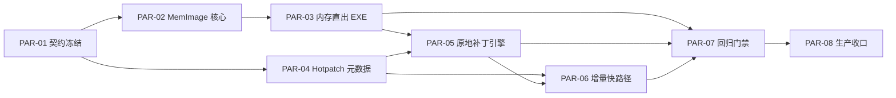

# Cheng Full Plan 并行任务矩阵（Linkerless + DOD + 语义特化）

要在工业级编译器的传统赛道上（即追求横跨几十种 CPU 架构的通用性、以及极限的 O3 级微指令压榨）通过纯自研去**正面全面击败** LLVM 和 mold/lld，对任何独立团队来说几乎是不可能的。因为它们背后是科技巨头数万人年和数百亿美金的投入，并且 mold 已经把操作系统的多核 I/O 压榨到了物理极限。

**但是！如果你改变游戏规则，进行“降维打击”（Paradigm Shift）**，采用下一代编译器的架构范式，你完全可以在**【编译速度】、【增量开发体验】以及【利用特定语言语义的优化】**上，将 LLVM 和 mold 远远甩在身后。

目前在最前沿的系统级语言（如 **Zig, Jai, Roc, Cranelift**）中，已经验证了这套自研破局方案。以下是为你量身定制的架构蓝图，可以让你自研的 `cheng` 语言大放异彩：

---

### 一、 碾压 mold / lld：走向“无链接器”（Linkerless）架构

mold 为什么快？因为它极致优化了读取 `.o` 文件、匹配字符串符号、重定位并写回磁盘的过程。但**只要你还在走“生成 .o 文件再链接合并”的老路，你就永远受限于磁盘 I/O，不可能比它快**。

#### 1. 全局内存直出二进制 (Monolithic Direct-to-Executable)

既然 `cheng` 拥有自己完全掌控的前后端生态，为什么还要遵守 C 语言上世纪 70 年代的碎片化 `.o` 目标文件标准？

* **超越方案**：**废弃 `.o` 文件的概念，彻底消灭链接器**。编译器将整个项目（包含依赖包）一次性解析进内存，构建全局的 UIR 图。
* **做法**：符号决议直接在内存中通过指针或数组索引完成（毫无字符串 Hash 匹配开销）。代码生成时，直接在内存里排布 `.text` 和 `.data` 段，计算好虚拟内存偏移量（VA）写死进机器码。最后加上 ELF/PE 头，**通过一次 `mmap` 或 `write` 系统调用，直接从内存吐出最终的可执行文件**。
* **战果**：将“链接”时间直接降维归零（在毫秒级内完成）。天才程序员 Jonathan Blow 的 **Jai** 语言以及 **V 语言** 采用的正是这种架构，编译数十万行代码只需零点几秒，碾压 C++ + mold。

#### 2. 终极神技：原地二进制热补丁 (In-Place Binary Patching)

* **超越方案**：Dev 轨采用 `Trampoline + Append-Only + Host Runner`，避免直接覆写旧函数体。
* **做法**：调用点固定经 `thunk` 路由；热更时把新代码追加到代码池尾部，最后原子切换 `target slot`。布局哈希变化时不做危险补丁，直接受控冷重启。
* **战果**：增量提交与运行态切换保持毫秒级，并且把“函数变长导致覆盖相邻代码”的崩溃风险降到可控重启路径。

---

### 二、 碾压 LLVM 的编译速度：数据导向设计（DOD）

LLVM 编译速度极慢、极其吃内存的根本原因是：它的 AST 和 IR 采用了极度面向对象（OOP）的设计，一条指令就是一个 C++ 对象，内存中散落着海量的细粒度节点，用无数的指针（Use-Def 链）串联，导致 CPU 缓存命中率（Cache Miss）极低。

#### 1. 数组化的线性中间表示 (Struct of Arrays, SoA)

* **超越方案**：彻底抛弃基于树（Tree）或链表（Linked List）的对象指针结构，重构你的 `uir_core_types.cheng`。
* **做法**：使用 Arena 内存池。将所有的 AST 节点、UIR 指令、基本块全部平铺在**巨大的、连续的结构体数组中**。指令之间的引用绝对不用指针，而是用 **32 位整数索引（Index）** 指向数组位置。
* **战果**：这能让编译器在遍历和优化代码时，完美契合现代 CPU 的 L1/L2 Cache 预取机制。前端解析和 IR 生成速度可以达到 LLVM 的 **10 倍到 50 倍以上**。

---

### 三、 在特定性能上追平/反超 LLVM：高阶语义降维

LLVM 的优化是通用且保守的。它最难做好的优化是“别名分析”（Alias Analysis）。面对 C/C++ 的指针，LLVM 必须保守地假设“任何两个指针都可能指向同一块内存”，导致它**不敢**激进地进行指令重排、内存合并和自动向量化。

#### 1. 榨取所有权（Ownership）的红利

* **超越方案**：`cheng` 拥有类似 Rust 的 `ownership` 系统。通过借用检查器，你在前端就拥有了**绝对的无别名保证（No-Alias）**（明确知道哪些是独占的 `&mut`）。
* **做法**：将这种数学证明级别的保证直接下发给你的自研后端。有了这个底气，你的自研后端可以像脱缰的野马一样，进行 LLVM 绝不敢做的**极限内存提升（Memory-to-Register Promotion）和深度的 SIMD 循环向量化**。在安全代码下，你生成的汇编比 LLVM 更短、更快。

#### 2. E-Graphs（等价饱和优化）

* **超越方案**：LLVM 的优化是链式线性的，存在“相位排序问题”（先做 A 优化还是先做 B 优化会互相干扰，错失最优解）。
* **做法**：将你的优化器升级为 **E-Graphs**（参考 Rust 社区的 `egg` 库或 Cranelift 引擎）。在编译时，同时在内存中保留一条指令的所有数学等价形式（如 `a * 2` 和 `a << 1`），利用代价模型（Cost Model）一次性搜索出特定 CPU 架构下的全局最优指令序列。用极少的代码量实现“超级优化”。

---

### 给 Cheng 语言的务实落地建议

从您的代码库可以看出，`cheng` 已经有了 `elf_writer` 和 `macho_writer`。你们其实**完全具备了实现“Linkerless 无链接器架构”的底座**。

如果你想将 `cheng` 打造成世界顶尖的现代语言，建议采取**双轨制（Dual-Backend）演进路线**：

1. **Dev Mode（极速开发后端 - 纯自研）**：
* **干掉文件链接**：停止维护 `elf_linker.cheng` 中去解析 `.o` 文件的冗余逻辑。把 `writer` 升级为内存全局 UIR 直出 `.exe`。
* **全面采用 DOD 架构**：结合简单的线性扫描寄存器分配，实现按下保存键 **100毫秒内** 完成 10 万行代码的编译+运行。给开发者前所未有的震撼体验。


2. **Release Mode（极限发布后端 - 借力打力）**：
* 不要头铁去手写数百种 x86-64 的微架构指令调优。
* Release 主链固定为 `UIR -> .o -> system linker`，并优先复用 `mold`（不可用回退 `lld`，再回退系统默认 linker）做 `O3/LTO` 发布收敛。


3. **专注特定领域的特化（比如 Decentralized 场景）**：
* 针对您的 `src/decentralized/metering.cheng`（计费插桩），自研后端可以做到极其轻量。在生成 Wasm 或 UIR 阶段，直接原生地织入 Gas 计算指令。在这个细分的智能合约流式编译（Streaming Compilation）赛道上，笨重的 LLVM 毫无用武之地，这是你的绝对护城河。


**不要用自研去硬刚传统编译器的通用海量微指令调优，而是用全新架构在“编译速度、开发体验、以及特定领域的高层语义”上对它们进行降维打击。** 这才是自研编译器的终极浪漫。

## 0. 锁定目标（硬约束）
- `Dev Mode`：自研极速路径，优先实现 `Linkerless`（减少/消灭 `.o` 中间态）。
- `Release Mode`：保留借力路径，`UIR -> .o -> system linker(mold|lld)`。
- `性能优先级`：先追求 `编译速度 + 增量体验`，再追求全平台极限微架构调优。
- `平台顺序`：第一阶段硬门禁 `Darwin + Linux`。
- `语义护城河`：充分利用 Ownership/No-Alias、Metering 场景特化。

## 0.1 最近收口（2026-02-21）
- `backend.import_cycle_predeclare` 已升级为纯 runtime 门禁：负例必须编译失败并输出 `Import cycle detected: ... -> ...` 链路；不再接受 source-contract 回退。
- 前端导入循环检测已修复为 active import trace 函数级 push/pop 守卫，避免递归加载中提前 pop 导致的环路漏检。
- `build_backend_driver.sh` 自举编译统一注入 `STAGE1_SKIP_*` 与 `CHENG_STAGE1_SKIP_*` 双口径，兼容 seed stage0 前缀差异并稳定自举链路。

## 4. 关键依赖图（Memory-Exe + Hotpatch）


## 5. 里程碑映射（建议）
| 批次 | 月份 | 可并行任务包 | 批次出口 |
|---|---|---|---|
| `W0` | `M1` | `PAR-01` | 契约冻结 + baseline 骨架 |
| `W1` | `M2-M4` | `PAR-02` + `PAR-04` | 内存镜像核心 + 热补丁元数据 |
| `W2` | `M4-M6` | `PAR-03` + `PAR-05` | 直出可执行 + 原地补丁事务 |
| `W3` | `M6-M8` | `PAR-06` + `PAR-07` | 脏函数增量快路径 + 性能/稳定门禁 |
| `W4` | `M8-M9` | `PAR-08` | 生产闭环与值班手册收口 |

## 6. 必过门禁（建议 required）
- `backend.mem_contract`
- `backend.mem_image_core`
- `backend.mem_exe_emit`（runtime 合并 + 原子写盘，sidecar 残留为 0）
- `backend.hotpatch_meta`
- `backend.hotpatch_inplace`
- `backend.incr_patch_fastpath`
- `backend.mem_patch_regression`
- `backend.closedloop`

## 7. 团队切片（最小配置）
- `小队A（2人）`：`PAR-01` + `PAR-07`
- `小队B（2人）`：`PAR-02` + `PAR-03`
- `小队C（2人）`：`PAR-04` + `PAR-05`
- `小队D（1-2人）`：`PAR-06`
- `小队E（1人）`：`PAR-08`

## 8. 执行铁律
- 不允许跳过契约冻结直接实现功能；所有二进制格式字段先文档后代码。
- 本轮已改 `chengc`：新增 `--release` 与 `BACKEND_BUILD_TRACK`，继续复用现有 `backend_driver/tooling` 主链落地。
- Dev 执行默认：`chengc --run` 走 host runner（`--run:host`）；`--run:file` 保留兼容回退。
- 热补丁主链默认：`BACKEND_HOTPATCH_MODE=trampoline` + `BACKEND_HOTPATCH_LAYOUT_HASH_MODE=full_program` + `BACKEND_HOTPATCH_ON_LAYOUT_CHANGE=restart`。
- 任何“原地补丁成功”都必须伴随“失败可回退且可运行”证据。
- 性能结论必须附 `baseline + 同机复测命令 + 报告路径`。
- 生产闭环采用双轨 required：Dev 主链 `emit=exe + self/linkerless`，Release 主链 `emit=exe + system linker`。


## 10. Codex 并行任务提示词（按合并任务包）

### 10.1 全局上下文前缀
```text
你在仓库 /Users/lbcheng/cheng-lang 内工作。请执行指定并行任务包（PAR-*），并严格遵守：
1) 目标聚焦：全局内存直出二进制（Memory-Exe）+ 原地热补丁（In-Place Hotpatch）。
2) 本轮默认不改 chengc；优先复用 src/backend/tooling/backend_driver.cheng 与 src/tooling 现有链路。
3) 任何新增/变更 schema、ENV、gate 名称必须同步更新 docs/cheng-plan-full.md。
4) 输出必须包含：修改文件、契约变更、门禁命令、结果摘要、风险点。
5) 若依赖 PAR 未完成，先输出阻塞点与最小解阻方案，再继续可并行部分。
```

## 11. DOD + 高阶语义降维并行矩阵

### 11.1 目标与边界
- 目标A：以 `SoA + Arena + int32 index` 重构前后端热路径，降低 cache miss，压缩编译时延。
- 目标B：把 `ownership/borrow` 语义事实下沉为后端可消费的 `no-alias` 约束，驱动更激进优化。
- 目标C：用 `E-Graph + Cost Model` 收敛“相位排序问题”，在目标架构上选择更优指令序列。
- IR 分层原则：`DOD/SoA`、`Memory-Exe/Hotpatch`、`E-Graph` 继续以 `Low-UIR` 为主战场；`Ownership/No-Alias` 必须在具备 `MIR` 语义的 `High-UIR` 阶段完成证明后再下沉。
- 改动边界：`src/stage1` + `src/backend/uir` + `src/backend/machine` + `src/tooling` + `docs`。
- 不在本轮范围：Memory-Exe/Hotpatch 主链路重构、发布流程改造、包管理协议变更。

### 11.6 必过门禁（DOD + 语义特化）
- `backend.dod_contract`
- `backend.dod_soa`
- `backend.mir_borrow`
- `backend.noalias_opt`
- `backend.egraph_cost`
- `backend.dod_opt_regression`
- `backend.closedloop`

### 11.7 Codex 并行任务提示词（DOD + 语义特化）

#### 11.7.1 全局上下文前缀
```text
你在仓库 /Users/lbcheng/cheng-lang 内工作。请执行指定并行任务包（DOPAR-*），并严格遵守：
1) 目标聚焦：DOD（SoA/Arena/int32 index）+ 高阶语义降维（No-Alias + E-Graph）。
2) 不改 Memory-Exe/Hotpatch 主链路语义；仅在 DOD/OPT 边界内改动。
3) 任何新增/变更 schema、ENV、gate 名称必须同步更新 docs/cheng-plan-full.md。
4) 输出必须包含：修改文件、性能口径、门禁命令、结果摘要、风险点。
5) 若依赖任务未完成，先输出阻塞点与最小解阻方案，再继续可并行部分。
```

### 11.10 IR 层级裁决（新增：UIR 与 MIR 语义边界）
核心结论：
- 在本计划六类极客方案里，`全局直出二进制`、`原地热补丁`、`DOD/SoA`、`E-Graph` 四项以 `Low-UIR` 为最佳战场。
- 唯一例外是 `Ownership + No-Alias`：若只在底层 `UIR` 做，将不可避免丢失生命周期与独占关系，必须依赖具备 `MIR` 语义的高层表示。

| 方案 | 最佳 IR 层级 | 结论 |
|---|---|---|
| 全局内存直出二进制 | `Low-UIR/LIR` | 只依赖段布局、重定位、寄存器与机器码偏移，UIR 足够且更直接 |
| 原地二进制热补丁 | `Low-UIR/LIR` | 只依赖函数物理窗口、slot 与补丁事务，UIR 足够且更稳 |
| DOD/SoA 重构 | `IR 容器层` | 是内存布局与遍历模型问题，与 MIR/UIR 语义层级无强耦合 |
| E-Graphs | `Low-UIR(SSA)` | 需要拍平、纯表达式化、可控副作用的 SSA 图，底层 UIR 搜索空间更可控 |
| Ownership/Borrow 检查 | `High-UIR(MIR语义)` | 需要 CFG + 变量作用域 + 高级类型信息；仅 AST 或仅 Low-UIR 都不可靠 |
| No-Alias 事实导出 | `High-UIR -> Low-UIR` | 必须先在 High-UIR 证明，再把结果下沉为 Low-UIR 优化 hint |

最后一步代码生成责任归属（Dual-Track 裁决）：
- Dev（极速开发）由自研 writer/linkerless 路径完成最终 EXE 发射（承载内存直出与原地热补丁）。
- Release（极限发布）由 system linker 完成最终收敛（优先 `mold`，回退 `lld`），编译器保留可回退开关 `--linker:self` / `BACKEND_LINKER=self`。

原因澄清：
- 仅 AST 不足：缺少统一 CFG 与稳定块级数据流，复杂控制流下生命周期分析误报率高。
- 仅 Low-UIR 不足：降级后结构体与借用关系被 base+offset 与 load/store 打散，语义不可逆恢复。
- `MIR` 的必要性不是“新数据结构”，而是“保留语义的分析阶段”。

### 11.11 单一 IR 双相模型（新增：P4 设计基线）
设计目标：
- 保留单一 DOD/SoA 存储，不新增独立 MIR 容器与大规模中间拷贝。
- 在同一套 `UIR` 数组上运行两个阶段：`High-UIR`（事实上的 MIR）与 `Low-UIR`（SSA/CodeGen）。

`High-UIR`（MIR 语义阶段）：
- 已建立 CFG。
- 保留高级类型与借用来源（未拍平为纯字节偏移）。
- 暂不做激进 SSA 重写，保留易于借用检查的内存/局部语义。
- 产出可证明的 Ownership 事实：`owned/borrowed/unmanaged`、escape class、noalias proof id。

`Low-UIR`（优化与产物阶段）：
- 在同一 SoA 容器上原地 lower：结构体访问拍平、SSA 化、指令归一化。
- 消费 `High-UIR` 下沉的 `noalias` 证明标签，驱动 mem2reg、forward、egraph、向量化等优化。
- 继续走既有 `Memory-Exe/Hotpatch` 产物链路，不改变主链语义。

阶段切换契约（必须保持）：
- 不引入第二份 MIR 实体；仅增加 phase tag 与必要字段。
- `High-UIR -> Low-UIR` 的事实传递必须可审计（profile + compile stamp + fallback reason）。
- 任一函数若证明失效，允许函数级 deopt 回退，不影响全局 determinism。


传统安全语言（如 Rust、Zig、Go）在面对 C ABI 时，最后都无奈地选择了向现实妥协：在语言中暴露出丑陋且危险的裸指针（`*mut T`, `void*`）和指针算术运算。这就像在一个无菌手术室里开了一扇通往臭水沟的暗门。

特别是对于 `cheng` 语言来说，你们的终极愿景包含**去中心化网络（Decentralized）和智能合约的沙盒计费**。一旦在语言层面暴露出裸指针和 `ptr + 1` 的运算，就会彻底摧毁你的“无别名（No-Alias）”假设，导致 E-Graphs 优化失效，智能合约的安全沙盒也会被轻易击穿。

如果结合我们之前推演的 **“C Backend 降维打击”** 和 **“DOD 数据导向”** 架构，你**完全可以在语言表面 100% 消灭裸指针语法，并且依然与 C ABI 完美丝滑互操作**。

这套方案的底层哲学是：**“指针仅仅是机器寻址的物理载体，绝不应该作为高层语义暴露给开发者。”**

以下是实现“绝对零指针 FFI”的 4 大核心设计（我称之为 **语义影子桥接 Semantic Shadow Bridge**）：

---

### 核心一：用“胖切片 (Slice)”彻底替代“指针+长度”

C 语言最常见的指针场景是传递数组或缓冲区：`void process_data(uint8_t* buf, size_t len);`。手动管理两者极易引发缓冲区溢出。

* **Cheng 语言侧（完全零指针）**：
在 `cheng` 中，开发者只能使用安全的切片借用，如 `&mut [u8]` 或内置的 `Buffer`。语言层完全没有指针加减法。
* **后端的“影子垫片 (Shim)”降级**：
得益于你采用了 **C Backend**，编译器在生成 C 代码时，会自动把安全的切片“物理拆包”，生成一个不可见的 C 包装器。

**【Cheng 源码】（极其安全）：**

```cheng
// 告诉编译器：C ABI 的参数 0 对应切片的 ptr，参数 1 对应 len
@ffi_map(ptr = arg0, len = arg1)
importc fn process_data(data: &mut [u8])

fn main() {
    var buf = [1, 2, 3]
    process_data(&mut buf) // 传安全切片，借用检查器保证生命周期安全
}

```

**【C Backend 自动生成的底层代码】（脏活全由编译器代劳）：**

```c
extern void process_data(uint8_t* ptr, size_t len); // 真实的 C 函数

// 编译器自动生成的垫片函数
static inline void cheng_ffi_process_data(ChengSlice_u8 data) {
    process_data(data.ptr, data.len); // 在物理层完美拆包对接 C ABI
}

```

### 核心二：用“多返回值 (Tuple)”彻底消灭“出参指针 (Out-Ptr)”

C 语言没有多返回值，遇到需要返回多个状态时，必须传入指针：`int get_size(int input, int* out_w, int* out_h);`。

* **Cheng 语言侧（优雅的元组）**：
利用现代语言的元组（Tuple）。语言层完全禁止声明类似 `*int` 这样的未初始化输出类型。
* **后端的“影子垫片”降级**：
通过编译器注解，让 C Backend 自动在栈帧上分配局部变量，并**隐式地取地址（`&`）** 传递给 C 函数，最后打包成元组返回。

**【Cheng 源码】（优雅的多返回值）：**

```cheng
// 注解告诉编译器：第2和第3个物理参数是出参指针，不用暴露在函数签名里
@ffi_out_ptrs(arg1, arg2) 
importc fn get_size(input: int32) -> (int32, int32, int32) 

fn main() {
    let (status, w, h) = get_size(1080) // 纯粹的值语义，没有指针满天飞
}

```

**【C Backend 自动生成的底层代码】：**

```c
int get_size(int input, int* w, int* h);

cheng_tuple_i32_3 cheng_ffi_get_size(int32_t input) {
    int32_t out_w, out_h;
    // 编译器偷偷帮你写了 '&' 满足 C ABI 的变态要求
    int32_t status = get_size(input, &out_w, &out_h); 
    return (cheng_tuple_i32_3){status, out_w, out_h};
}

```

### 核心三：用“DOD 强类型句柄 (Handle)”替代 `void*` 和不透明指针

C 库极其喜欢返回你不该触碰的黑盒指针，比如 `sqlite3*` 或 `GLFWwindow*`。一旦暴露出这种指针，开发者如果错误地执行强转或释放，就会引发段错误。

* **Cheng 语言侧（DOD 的终极胜利）**：
在 `cheng` 中，所有的 C 句柄统统定义为 **纯数字 ID（u32 或 u64）**。
* **后端的“影子垫片”降级（绝对安全的沙盒映射法）**：
这正是 DOD 架构的灵魂！在 Cheng 的 Runtime 中，维护一个由 Arena 分配的 `void*` 全局数组。C 返回的指针存入数组，把数组的 `Index (u32)` 返回给 Cheng。Cheng 拿着 `Index` 去操作时，Runtime 进行 `O(1)` 的查表还原出 `void*` 给 C。

**【Cheng 源码】（只暴露数字 ID）：**

```cheng
// 语言层只知道它是个纯数字句柄（Token ID），绝对无法解引用
type SqliteDb = distinct u32 

importc fn sqlite3_close(db: SqliteDb)

```

**逆天优势**：这直接消灭了 C FFI 中最可怕的 **Use-After-Free（释放后重用）** 漏洞。如果 C 结构体被释放了，运行时把数组对应的槽位标记为“过期”。如果 Cheng 开发者拿着过期的 `Handle ID` 去调 C 函数，**程序只会安全地 Panic，而绝对不会引发恶性的 C 级别内存崩溃**。黑客根本无从下手！

### 核心四：结构体指针 —— 全面拥抱“借用 (Borrow)”

当 C 需要传入一个复杂结构体的指针以避免值拷贝时（如 `void update_config(Config* cfg);`）。

* **Cheng 语言侧**：直接使用所有权机制中的借用引用 `&mut Config` 或 `&Config`。
* **后端处理**：前端利用 `&` 完成了极其严苛的生命周期和别名验证。一旦验证通过，下发到 C Backend 时，直接翻译为 C 的普通指针 `Config*`。**因为 Cheng 语法禁止对 `&Config` 进行指针算术运算，所以只要传进去了，它就只代表这个对象的固定内存，永远无法越界到其他内存。**

---

### 总结：为什么这套方案能让 Cheng 语言直接“封神”？

1. **让优化器（E-Graphs）和所有权系统发挥 100% 威力**
由于你从表面语法中抹除了裸指针，UIR 里流转的全部是**绝对没有别名（No-Alias）**的切片、值和整数 Handle。此时编译器拥有了完美的数学确定性，可以毫无顾忌地做极限内存提升和自动向量化。
2. **与 Web/Decentralized (WASM) 物理模型 100% 同构**
在 WebAssembly 和智能合约的沙盒里，**本来就不存在物理内存指针**。Wasm 的沙盒模型里只有一条线性内存（大数组），所谓的 C 指针在 WASM 里本来就是个 `i32` 的偏移量索引。你这套 Handle + Slice 的抽象，天生就是为去中心化虚拟机量身定制的！
3. **把脏活累活全部甩给 C Backend**
这就是为什么我强烈推荐你走**生成 C 源码（路线 A）**。如果是自研机器码后端，你自己手写汇编去处理垫片（Shim）的寄存器传参和栈对齐会让你痛不欲生。但交给 C Backend，生成这些垫片就像写普通文本一样自然，系统的 Clang 编译器会自动帮你搞定所有 ABI 对齐。

**“真正的内存安全，不是教开发者如何小心翼翼地拿捏裸指针，而是直接把这把带血的刀从语法层面没收，交由编译器在底层黑盒中自动化完成。”** 采用这套方案，Cheng 语言的互操作安全性将远超如今的 Rust。
