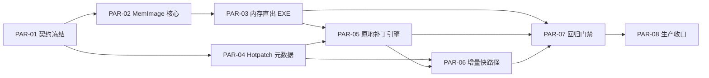

# Cheng Full Plan 并行任务矩阵（Linkerless + DOD + 语义特化）

要在工业级编译器的传统赛道上（即追求横跨几十种 CPU 架构的通用性、以及极限的 O3 级微指令压榨）通过纯自研去**正面全面击败** LLVM 和 mold/lld，对任何独立团队来说几乎是不可能的。因为它们背后是科技巨头数万人年和数百亿美金的投入，并且 mold 已经把操作系统的多核 I/O 压榨到了物理极限。

**但是！如果你改变游戏规则，进行“降维打击”（Paradigm Shift）**，采用下一代编译器的架构范式，你完全可以在**【编译速度】、【增量开发体验】以及【利用特定语言语义的优化】**上，将 LLVM 和 mold 远远甩在身后。

目前在最前沿的系统级语言（如 **Zig, Jai, Roc, Cranelift**）中，已经验证了这套自研破局方案。以下是为你量身定制的架构蓝图，可以让你自研的 `cheng` 语言大放异彩：

命令前缀约定（文内命令可直接执行）：
- `TOOLING=artifacts/tooling_cmd/cheng_tooling`
- 示例中的 `$TOOLING <subcmd>` 等价于直接调用 canonical tooling binary。

---

### 一、 碾压 mold / lld：走向“无链接器”（Linkerless）架构

mold 为什么快？因为它极致优化了读取 `.o` 文件、匹配字符串符号、重定位并写回磁盘的过程。但**只要你还在走“生成 .o 文件再链接合并”的老路，你就永远受限于磁盘 I/O，不可能比它快**。

#### 1. 全局内存直出二进制 (Monolithic Direct-to-Executable)

既然 `cheng` 拥有自己完全掌控的前后端生态，为什么还要遵守 C 语言上世纪 70 年代的碎片化 `.o` 目标文件标准？

* **超越方案**：**废弃 `.o` 文件的概念，彻底消灭链接器**。编译器将整个项目（包含依赖包）一次性解析进内存，构建全局的 UIR 图。
* **做法**：符号决议直接在内存中通过指针或数组索引完成（毫无字符串 Hash 匹配开销）。代码生成时，直接在内存里排布 `.text` 和 `.data` 段，计算好虚拟内存偏移量（VA）写死进机器码。最后加上 ELF/PE 头，**通过一次 `mmap` 或 `write` 系统调用，直接从内存吐出最终的可执行文件**。
* **战果**：将“链接”时间直接降维归零（在毫秒级内完成）。天才程序员 Jonathan Blow 的 **Jai** 语言以及 **V 语言** 采用的正是这种架构，编译数十万行代码只需零点几秒，碾压 C++ + mold。

#### 2. 终极神技：原地二进制热补丁 (In-Place Binary Patching)

* **超越方案**：Dev 轨采用 `Trampoline + Append-Only + Host Runner`，避免直接覆写旧函数体。
* **做法**：调用点固定经 `thunk` 路由；热更时把新代码追加到代码池尾部，最后原子切换 `target slot`。布局哈希变化时不做危险补丁，直接受控冷重启。
* **战果**：增量提交与运行态切换保持毫秒级，并且把“函数变长导致覆盖相邻代码”的崩溃风险降到可控重启路径。

---

### 二、 碾压 LLVM 的编译速度：数据导向设计（DOD）

LLVM 编译速度极慢、极其吃内存的根本原因是：它的 AST 和 IR 采用了极度面向对象（OOP）的设计，一条指令就是一个 C++ 对象，内存中散落着海量的细粒度节点，用无数的指针（Use-Def 链）串联，导致 CPU 缓存命中率（Cache Miss）极低。

#### 1. 数组化的线性中间表示 (Struct of Arrays, SoA)

* **超越方案**：彻底抛弃基于树（Tree）或链表（Linked List）的对象指针结构，重构你的 `uir_core_types.cheng`。
* **做法**：使用 Arena 内存池。将所有的 AST 节点、UIR 指令、基本块全部平铺在**巨大的、连续的结构体数组中**。指令之间的引用绝对不用指针，而是用 **32 位整数索引（Index）** 指向数组位置。
* **战果**：这能让编译器在遍历和优化代码时，完美契合现代 CPU 的 L1/L2 Cache 预取机制。前端解析和 IR 生成速度可以达到 LLVM 的 **10 倍到 50 倍以上**。

---

### 三、 在特定性能上追平/反超 LLVM：高阶语义降维

LLVM 的优化是通用且保守的。它最难做好的优化是“别名分析”（Alias Analysis）。面对 C/C++ 的指针，LLVM 必须保守地假设“任何两个指针都可能指向同一块内存”，导致它**不敢**激进地进行指令重排、内存合并和自动向量化。

#### 1. 榨取所有权（Ownership）的红利

* **超越方案**：`cheng` 拥有类似 Rust 的 `ownership` 系统。通过借用检查器，你在前端就拥有了**绝对的无别名保证（No-Alias）**（明确知道哪些是独占的 `&mut`）。
* **做法**：将这种数学证明级别的保证直接下发给你的自研后端。有了这个底气，你的自研后端可以像脱缰的野马一样，进行 LLVM 绝不敢做的**极限内存提升（Memory-to-Register Promotion）和深度的 SIMD 循环向量化**。在安全代码下，你生成的汇编比 LLVM 更短、更快。

#### 2. E-Graphs（等价饱和优化）

* **超越方案**：LLVM 的优化是链式线性的，存在“相位排序问题”（先做 A 优化还是先做 B 优化会互相干扰，错失最优解）。
* **做法**：将你的优化器升级为 **E-Graphs**（参考 Rust 社区的 `egg` 库或 Cranelift 引擎）。在编译时，同时在内存中保留一条指令的所有数学等价形式（如 `a * 2` 和 `a << 1`），利用代价模型（Cost Model）一次性搜索出特定 CPU 架构下的全局最优指令序列。用极少的代码量实现“超级优化”。

---

### 给 Cheng 语言的务实落地建议

从您的代码库可以看出，`cheng` 已经有了 `elf_writer` 和 `macho_writer`。你们其实**完全具备了实现“Linkerless 无链接器架构”的底座**。

如果你想将 `cheng` 打造成世界顶尖的现代语言，建议采取**双轨制（Dual-Backend）演进路线**：

1. **Dev Mode（极速开发后端 - 纯自研）**：
* **干掉文件链接**：停止维护 `elf_linker.cheng` 中去解析 `.o` 文件的冗余逻辑。把 `writer` 升级为内存全局 UIR 直出 `.exe`。
* **全面采用 DOD 架构**：结合简单的线性扫描寄存器分配，实现按下保存键 **100毫秒内** 完成 10 万行代码的编译+运行。给开发者前所未有的震撼体验。


2. **Release Mode（极限发布后端 - 借力打力）**：
* 不要头铁去手写数百种 x86-64 的微架构指令调优。
* Release 主链固定为 `UIR -> .o -> system linker`，并优先复用 `mold`（不可用回退 `lld`，再回退系统默认 linker）做 `O3/LTO` 发布收敛。


3. **专注特定领域的特化（比如 Decentralized 场景）**：
* 针对您的 `src/decentralized/metering.cheng`（计费插桩），自研后端可以做到极其轻量。在生成 Wasm 或 UIR 阶段，直接原生地织入 Gas 计算指令。在这个细分的智能合约流式编译（Streaming Compilation）赛道上，笨重的 LLVM 毫无用武之地，这是你的绝对护城河。


**不要用自研去硬刚传统编译器的通用海量微指令调优，而是用全新架构在“编译速度、开发体验、以及特定领域的高层语义”上对它们进行降维打击。** 这才是自研编译器的终极浪漫。

## 0. 锁定目标（硬约束）
- `Dev Mode`：自研极速路径，优先实现 `Linkerless`（减少/消灭 `.o` 中间态）。
- `Release Mode`：保留借力路径，`UIR -> .o -> system linker(mold|lld)`。
- `性能优先级`：先追求 `编译速度 + 增量体验`，再追求全平台极限微架构调优。
- `平台顺序`：第一阶段硬门禁 `Darwin + Linux`。
- `语义护城河`：充分利用 Ownership/No-Alias、Metering 场景特化。

## 0.1 最近收口（2026-02-21）
- `backend.import_cycle_predeclare` 已升级为纯 runtime 门禁：负例必须编译失败并输出 `Import cycle detected: ... -> ...` 链路；不再接受 source-contract 回退。
- 前端导入循环检测已修复为 active import trace 函数级 push/pop 守卫，避免递归加载中提前 pop 导致的环路漏检。
- `build_backend_driver` 自举编译统一注入 `STAGE1_SKIP_*` 与 `STAGE1_SKIP_*` 双口径，兼容 seed stage0 前缀差异并稳定自举链路。

## 0.2 闭环状态快照（2026-02-25）
- 判定口径：以 `backend_prod_closure` 的 required gates 为准（主执行入口为 `src/tooling/cheng_tooling.cheng` 原生命令；embedded payload 仅保留兼容回退面）。
- 运行时内嵌查询：`$TOOLING embedded-ids/embedded-text` 直接读取 `tooling/cheng_tooling_embedded_inline`；内嵌 map 重写统一走 `$TOOLING embedded-map-rewrite`（仓库已移除 Python query 脚本）。
- 最近一次本仓库实跑记录：`artifacts/backend_prod_closure/last_run.log`，包含 `verify_backend_closedloop ok` 与 `backend_prod_closure ok`。
- 关键门禁实跑通过（PAR-01~PAR-07 主链）：`backend.mem_contract`、`backend.mem_image_core`、`backend.mem_exe_emit`、`backend.hotpatch_meta`、`backend.hotpatch_inplace`、`backend.incr_patch_fastpath`、`backend.mem_patch_regression`、`backend.closedloop`。
- `PAR-08` 状态：已完成“除平台生产闭环”收口（Dev: `emit=exe + self/linkerless`；Release: `emit=exe + system linker`）；dev gate 收口与发布尾链已拆分为 `backend_prod_closure` 与 `backend-prod-publish` 两个原生命令。
- 未完成项：全平台完整闭环仍在推进，`Windows` 完整可运行生产闭环仍待补齐（见 `docs/cheng-build-any-platform.md` 的“不在范围（当前阶段）”与“2.3 生产闭环现状（除平台）”）。
- Host-only 严格收口（2026-02-25 当前实现）：
  - `SELFHOST_STRICT_REBUILD=1`（默认）会强制 `verify_backend_selfhost_100ms_host` 走 `compile-stage1 + full rebuild + require rebuild`，并阻断任何非真实重编通过路径。
  - `BUILD_DRIVER_STRICT_NATIVE=1`（默认），`build-backend-driver` 回退链路（`shim/reused_stage0/legacy relink/delegate wrapper`）已硬关闭。
  - `verify_backend_selfhost_100ms_host` 报告新增结构化字段：`stage0_driver_kind/fallback_used/quarantine_cleaned/lock_wait_ms/strict_rebuild_ok`。
  - `backend_prod_closure` required 链路新增 `backend.opt2_impl_surface`（`verify_backend_opt2_impl_surface`）。

## 0.3 最近修复快照（2026-02-28）
- backend driver 单一化：`cheng/release-compile` 与 `backend_prod_closure/backend-prod-publish` 统一固定 canonical driver `artifacts/backend_driver/cheng`；`compile/chengc` 入口已移除（固定 `rc=2`）。
- 配置面收口：`BACKEND_DRIVER/CHENG_BACKEND_DRIVER` 覆盖入口已移除，`driver-path` 改为结构化输出（`toolchain_root/driver_path/driver_sha256/driver_kind=canonical`）。
- stage0 覆盖入口收口：`SELF_OBJ_BOOTSTRAP_STAGE0`、`BACKEND_BUILD_DRIVER_STAGE0`、`backend_prod_closure --seed*` 的 driver 覆盖语义已移除；`selfhost/bootstrap/100ms` 不再接受 `--stage0`。
- 生态接入收口：`cheng-codex/cheng-gui` 与指定外部仓库脚本改为统一调用 `cheng_tooling toolchain-root + driver-path + compile`，不再自行探测 driver 候选链。
- 跨工作区 UE 治理：新增 `stage0-ue-clean --global`，并把 UE/orphan 匹配收口到 stage0 quarantine + canonical driver 相关命令。
- self-link 稳定性修复：`std/bytes.readFileBytes` 改为 `fileSize` 预分配 + 顺序读取，并统一走 `c_fclose`，用于消除 `machoParseObj -> readFileBytes -> fclose` 崩溃链（`rc=139`）。
- stage0 quarantine 误阻断修复：`tooling_stage0BlockOnQuarantineUe` 增加“清理后短重检”机制（`TOOLING_STAGE0_QUARANTINE_BLOCK_RECHECKS`，默认 `2`），降低“首轮已清理但仍阻断”的抖动。
- stage0 能力前置校验：`build-backend-driver` 默认启用 `TOOLING_STAGE0_CAPABILITY_PREFLIGHT=1`，比较 stage0 `.cap` 签名与当前 `stage1/parser+ast+semantics+ownership+monomorphize+type_syntax_lowering + uir_core_types + backend_driver` 源签名；不匹配时 fail-fast 并提示先 `bootstrap-pure --mode:strict` 刷新 seed/driver。成功重编会自动写回 `<driver>.cap.env`。
- strict fixed-point 诊断增强：`SELF_OBJ_BOOTSTRAP_MODE=strict` 若 `SHA256(stage2)!=SHA256(stage3)`，会自动产出 `<out-dir>/strict_mismatch/summary.env` 与 bytes/symbols/strings diff，命令输出新增 `bootstrap_pure_strict_mismatch_report` / `selfhost_bootstrap_strict_mismatch_report`。
- in-memory runtime probe 稳定化：`verify_backend_noalias_opt` / `verify_backend_egraph_cost` / `verify_backend_dod_opt_regression` 的 runtime probe 口径固定关闭 profile 输出（`UIR_PROFILE=0` + `BACKEND_PROFILE=0`），避免 `driver_profileStep -> fwrite` 路径段错误。
- 复验记录：`$TOOLING backend_prod_closure --no-publish`（dev gate）输出 `backend_prod_closure ok`；`$TOOLING verify_backend_selfhost_100ms_host --compile-stage1 --iters:30 --enforce:1` 实测 `p95=83ms`、`p99=91ms`。
- 编译入口收口：`cheng` 已移除 stage0 全局锁包装，默认仅保留 `preflight + timeout`，用于支持并发编译。
- build-driver 收口：full rebuild 默认 `BACKEND_BUILD_DRIVER_REBUILD_DIRECT_EXE=1`，并禁用 profile segfault fail-open（默认 `BACKEND_BUILD_DRIVER_PROFILE_FAIL_OPEN=0`）。
- native-contract 前端收口：`stage1_autoSystemEnabled()` 在 `BACKEND_NATIVE_CONTRACT=1` 时强制返回 `false`，不再依赖 gate 脚本注入 `STAGE1_AUTO_SYSTEM=0`。
- required gate 扩展：`backend.native_contract_autosystem`（`verify_backend_native_contract_autosystem`）已接入 `backend_prod_closure`。

### 0.4 最近修复快照（2026-03-01）
- `std/cmdline` 零裸指针收口：移除 `__cheng_setCmdLine(argc, argv: void*)` 与 `alloc/ptr_add/copyMem/setMem/*str*` 读取路径；改为 runtime bridge `__cheng_rt_paramCount/__cheng_rt_paramStr`，并通过 `__cheng_rt_paramStrCopy` 稳定转值语义字符串缓存。
- 入口迁移：`stage1/tooling/web` 等 `main(argc, argv)` 统一调用 `cmdline.__cheng_captureCmdLine(argc, argv)`（仅把参数转交 runtime C 影子桥；语言层不再做裸指针算术）。
- runtime C 新增并导出 `__cheng_setCmdLine`、`__cheng_rt_paramCount/__cheng_rt_paramStr/__cheng_rt_paramStrCopy`（兼容保留弱符号 `paramCount/paramStr` 一版）。
- `backend_prod_closure` required 新增并阻断：
  - `backend.rawptr_surface_forbid`（`verify_backend_rawptr_surface_forbid`，含 `std/cmdline` 无裸指针强检查）
  - `backend.stage1_ast_soa_surface`（`verify_stage1_ast_soa_surface`，输出 `stage1_ref_surface/uir_ref_surface/rawptr_surface` 快照；默认 `BACKEND_PROD_STAGE1_AST_SOA_ENFORCE=1` 硬阻断，设 `0` 可降为报告模式）
  - `backend.uir_soa_surface`（`verify_backend_uir_soa_surface`，SoA surface + runtime 合约；双次 runtime probe 断言 `soa_report` 一致）
  - `backend.uir_soa_self_probe`（`verify_backend_uir_soa_self_probe`，self-link 子探针固定阻断口径）
- `backend_prod_closure` required 扩展：
  - `backend.symbol_closure`（`verify_backend_symbol_closure`，阻断 `_alloc/_c_strlen/_zeroMem` 运行时符号缺失）
  - `backend.release_compile_stability`（`verify_backend_release_compile_stability`，固定 `return_new_ref_seq_growth` 3 次 release-compile 稳定性）
  - `backend.zero_script_residual`（`verify_backend_zero_script_residual`，阻断 required 路径 compile-only/skip 语义与 legacy `CHENG_*` 读取）
- release 稳定性修复：`release-compile --in:return_new_ref_seq_growth` 已可运行；`verify_backend_release_compile_stability` 默认 3 次通过。
- selfhost 100ms 复验：`$TOOLING selfhost-100ms-host --iters:30 --enforce:1` 当前实测 `p95=80ms`、`p99=120ms`。
- `uir_core_types` 新增 SoA surface 实体：`UirExprId/UirStmtId/UirBlockId/UirFuncId`、`UirCoreSoa`、`uirCoreSoaNew/Append*` 与 `uirCoreSoaBuildFromFunc`；`uir_opt` 新增 `soa_report`（默认关闭，gate 显式 `UIR_SOA_REPORT=1` 开启）。
- 2026-03-01 收口补充（SIMD + E-Graph）：
  - `uir_vectorize_slp` 从占位升级为可执行 SLP 重写（确定性项排序 + 平衡重建 + `simd_slp_report`）。
  - `uir_egraph_rewrite` 升级为“等价饱和 + 代价抽取”引擎（rule saturation、class/node budget、`egraph_report`）。
  - `backend_prod_closure` required 新增 `backend.simd`（`verify_backend_simd` 原生命令，compile determinism + 源实现硬校验）。
  - `verify_backend_egraph_cost` 增强为饱和引擎源实现硬校验 + 多目标（`balanced/latency/size`）编译探针。
  - `backend_native_contract.env` 已同步基线，`$TOOLING backend_prod_closure --no-publish` 实跑输出 `backend_prod_closure ok`（见 `artifacts/backend_prod_closure/last_run.log`）。

### 0.5 最近修复快照（2026-03-05）
- required embedded payload 收口：`verify_backend_mem_exe_emit` / `verify_backend_hotpatch` / `verify_backend_hotpatch_meta` / `verify_backend_mem_patch_regression` 默认 embedded 文本改为 `cheng` 调用；`verify_backend_mem_exe_emit` 额外移除 `BACKEND_DRIVER` 前缀注入并同步 `cheng_*` 报告字段命名。
- `verify_backend_zero_script_residual` 新增 required embedded 防回归：固定检查 `verify_backend_mem_exe_emit` / `verify_backend_hotpatch` / `verify_backend_hotpatch_meta` / `verify_backend_mem_patch_regression` / `verify_backend_incr_patch_fastpath` / `verify_backend_hotpatch_inplace`，阻断 `\bchengc\b` 与 `BACKEND_DRIVER=` 残留。
- `build-backend-driver` 收紧：`BACKEND_BUILD_DRIVER_REQUIRE_REBUILD` 默认值从 `0` 提升到 `1`，且在 `BUILD_DRIVER_STRICT_NATIVE=1` 下禁用 fast-path reuse 与重建失败后复用旧 canonical driver。
- C 文本发射已从工具链主入口移除；`backend_driver` 仅保留 `emit=exe`（以及内部 `emit=obj`）路径。
- `backend_prod_closure` required FFI gate 收口：`backend.ffi_slice_shim`、`backend.ffi_outptr_tuple`、`backend.ffi_handle_sandbox`、`backend.ffi_borrow_bridge` 纳入 required 链路。
- 能力 gate 收紧：
  - `verify_backend_noalias_opt` 改为多 fixture runtime 直编译探针，并新增 `proof_backed_changes_total/mem2reg_loads_total/forward_loads_total` 统计与硬门禁。
  - `verify_backend_egraph_cost` 改为 backend driver 直编译探针，新增 trace 级 determinism 硬门禁（`BACKEND_EGRAPH_COST_MAX_DETERMINISM_MISMATCH`，默认 `0`）并分离 `binary_hash_mismatch` 诊断字段。
  - `verify_backend_dod_opt_regression` 改为多 fixture runtime 直编译探针，并新增 `probe_count/proof_backed_changes_total/egraph_report_count_total` 报告字段。

复验命令（严格口径）：
- `$TOOLING backend_prod_closure --no-publish`

## 4. 关键依赖图（Memory-Exe + Hotpatch）

```mermaid
flowchart LR
  P1["PAR-01 契约冻结"]
  P2["PAR-02 MemImage 核心"]
  P3["PAR-03 内存直出 EXE"]
  P4["PAR-04 Hotpatch 元数据"]
  P5["PAR-05 原地补丁引擎"]
  P6["PAR-06 增量快路径"]
  P7["PAR-07 回归门禁"]
  P8["PAR-08 生产收口"]

  P1 --> P2
  P1 --> P4
  P2 --> P3
  P3 --> P5
  P4 --> P5
  P4 --> P6
  P5 --> P6
  P3 --> P7
  P5 --> P7
  P6 --> P7
  P7 --> P8
```

## 5. 里程碑映射（建议）
| 批次 | 月份 | 可并行任务包 | 批次出口 |
|---|---|---|---|
| `W0` | `M1` | `PAR-01` | 契约冻结 + baseline 骨架 |
| `W1` | `M2-M4` | `PAR-02` + `PAR-04` | 内存镜像核心 + 热补丁元数据 |
| `W2` | `M4-M6` | `PAR-03` + `PAR-05` | 直出可执行 + 原地补丁事务 |
| `W3` | `M6-M8` | `PAR-06` + `PAR-07` | 脏函数增量快路径 + 性能/稳定门禁 |
| `W4` | `M8-M9` | `PAR-08` | 生产闭环与值班手册收口 |

状态注记（2026-02-25）：
- `W4/PAR-08` 已完成“除平台”收口；全平台口径继续按 `docs/cheng-build-any-platform.md` 推进。

## 6. 必过门禁（required，2026-02-25 已接入 backend_prod_closure）
- `backend.mem_contract`
- `backend.mem_image_core`
- `backend.mem_exe_emit`（runtime 合并 + 原子写盘，sidecar 残留为 0）
- `backend.hotpatch_meta`
- `backend.hotpatch_inplace`
- `backend.incr_patch_fastpath`
- `backend.mem_patch_regression`
- `backend.closedloop`
- `backend.native_contract`
- `backend.native_contract_autosystem`
- `backend.symbol_closure`
- `backend.release_compile_stability`
- `backend.zero_script_residual`
- `backend.opt2_impl_surface`
- `backend.ffi_slice_shim`
- `backend.ffi_outptr_tuple`
- `backend.ffi_handle_sandbox`
- `backend.ffi_borrow_bridge`

## 7. 团队切片（最小配置）
- `小队A（2人）`：`PAR-01` + `PAR-07`
- `小队B（2人）`：`PAR-02` + `PAR-03`
- `小队C（2人）`：`PAR-04` + `PAR-05`
- `小队D（1-2人）`：`PAR-06`
- `小队E（1人）`：`PAR-08`

## 8. 执行铁律
- 不允许跳过契约冻结直接实现功能；所有二进制格式字段先文档后代码。
- 本轮已改编译入口：`cheng` 固定为 canonical dev-only 入口（`compile/chengc` 已移除）；release 轨改为显式入口 `release-compile`，并继续复用现有 `backend_driver/tooling` 主链落地。
- Dev 执行默认：`chengc --run` 走 host runner（`--run:host`）；`--run:file` 保留兼容回退。
- 热补丁主链默认：`BACKEND_HOTPATCH_MODE=trampoline` + `BACKEND_HOTPATCH_LAYOUT_HASH_MODE=full_program` + `BACKEND_HOTPATCH_ON_LAYOUT_CHANGE=restart`。
- 任何“原地补丁成功”都必须伴随“失败可回退且可运行”证据。
- 性能结论必须附 `baseline + 同机复测命令 + 报告路径`。
- 生产闭环采用双轨 required：Dev 主链 `emit=exe + self/linkerless`，Release 主链 `emit=exe + system linker`；FFI required 口径固定走 native UIR 影子桥接（slice/outptr/handle/borrow）。


## 10. Codex 并行任务提示词（按合并任务包）

### 10.1 全局上下文前缀
```text
你在仓库 /Users/lbcheng/cheng-lang 内工作。请执行指定并行任务包（PAR-*），并严格遵守：
1) 目标聚焦：全局内存直出二进制（Memory-Exe）+ 原地热补丁（In-Place Hotpatch）。
2) 本轮默认不改 chengc；优先复用 src/backend/tooling/backend_driver.cheng 与 src/tooling 现有链路。
3) 任何新增/变更 schema、ENV、gate 名称必须同步更新 docs/cheng-plan-full.md。
4) 输出必须包含：修改文件、契约变更、门禁命令、结果摘要、风险点。
5) 若依赖 PAR 未完成，先输出阻塞点与最小解阻方案，再继续可并行部分。
```

## 11. DOD + 高阶语义降维并行矩阵

### 11.1 目标与边界
- 目标A：以 `SoA + Arena + int32 index` 重构前后端热路径，降低 cache miss，压缩编译时延。
- 目标B：把 `ownership/borrow` 语义事实下沉为后端可消费的 `no-alias` 约束，驱动更激进优化。
- 目标C：用 `E-Graph + Cost Model` 收敛“相位排序问题”，在目标架构上选择更优指令序列。
- IR 分层原则：`DOD/SoA`、`Memory-Exe/Hotpatch`、`E-Graph` 继续以 `Low-UIR` 为主战场；`Ownership/No-Alias` 必须在具备 `MIR` 语义的 `High-UIR` 阶段完成证明后再下沉。
- 改动边界：`src/stage1` + `src/backend/uir` + `src/backend/machine` + `src/tooling` + `docs`。
- 不在本轮范围：Memory-Exe/Hotpatch 主链路重构、发布流程改造、包管理协议变更。

### 11.6 必过门禁（DOD + 语义特化）
- `backend.dod_contract`
- `backend.dod_soa`
- `backend.mir_borrow`
- `backend.noalias_opt`
- `backend.egraph_cost`
- `backend.dod_opt_regression`
- `backend.closedloop`

### 11.7 Codex 并行任务提示词（DOD + 语义特化）

#### 11.7.1 全局上下文前缀
```text
你在仓库 /Users/lbcheng/cheng-lang 内工作。请执行指定并行任务包（DOPAR-*），并严格遵守：
1) 目标聚焦：DOD（SoA/Arena/int32 index）+ 高阶语义降维（No-Alias + E-Graph）。
2) 不改 Memory-Exe/Hotpatch 主链路语义；仅在 DOD/OPT 边界内改动。
3) 任何新增/变更 schema、ENV、gate 名称必须同步更新 docs/cheng-plan-full.md。
4) 输出必须包含：修改文件、性能口径、门禁命令、结果摘要、风险点。
5) 若依赖任务未完成，先输出阻塞点与最小解阻方案，再继续可并行部分。
```

### 11.10 IR 层级裁决（新增：UIR 与 MIR 语义边界）
核心结论：
- 在本计划六类极客方案里，`全局直出二进制`、`原地热补丁`、`DOD/SoA`、`E-Graph` 四项以 `Low-UIR` 为最佳战场。
- 唯一例外是 `Ownership + No-Alias`：若只在底层 `UIR` 做，将不可避免丢失生命周期与独占关系，必须依赖具备 `MIR` 语义的高层表示。

| 方案 | 最佳 IR 层级 | 结论 |
|---|---|---|
| 全局内存直出二进制 | `Low-UIR/LIR` | 只依赖段布局、重定位、寄存器与机器码偏移，UIR 足够且更直接 |
| 原地二进制热补丁 | `Low-UIR/LIR` | 只依赖函数物理窗口、slot 与补丁事务，UIR 足够且更稳 |
| DOD/SoA 重构 | `IR 容器层` | 是内存布局与遍历模型问题，与 MIR/UIR 语义层级无强耦合 |
| E-Graphs | `Low-UIR(SSA)` | 需要拍平、纯表达式化、可控副作用的 SSA 图，底层 UIR 搜索空间更可控 |
| Ownership/Borrow 检查 | `High-UIR(MIR语义)` | 需要 CFG + 变量作用域 + 高级类型信息；仅 AST 或仅 Low-UIR 都不可靠 |
| No-Alias 事实导出 | `High-UIR -> Low-UIR` | 必须先在 High-UIR 证明，再把结果下沉为 Low-UIR 优化 hint |

最后一步代码生成责任归属（Dual-Track 裁决）：
- Dev（极速开发）由自研 writer/linkerless 路径完成最终 EXE 发射（承载内存直出与原地热补丁）。
- Release（极限发布）由 system linker 完成最终收敛（优先 `mold`，回退 `lld`），编译器保留可回退开关 `--linker:self` / `BACKEND_LINKER=self`。

原因澄清：
- 仅 AST 不足：缺少统一 CFG 与稳定块级数据流，复杂控制流下生命周期分析误报率高。
- 仅 Low-UIR 不足：降级后结构体与借用关系被 base+offset 与 load/store 打散，语义不可逆恢复。
- `MIR` 的必要性不是“新数据结构”，而是“保留语义的分析阶段”。

### 11.11 单一 IR 双相模型（新增：P4 设计基线）
设计目标：
- 保留单一 DOD/SoA 存储，不新增独立 MIR 容器与大规模中间拷贝。
- 在同一套 `UIR` 数组上运行两个阶段：`High-UIR`（事实上的 MIR）与 `Low-UIR`（SSA/CodeGen）。

`High-UIR`（MIR 语义阶段）：
- 已建立 CFG。
- 保留高级类型与借用来源（未拍平为纯字节偏移）。
- 暂不做激进 SSA 重写，保留易于借用检查的内存/局部语义。
- 产出可证明的 Ownership 事实：`owned/borrowed/unmanaged`、escape class、noalias proof id。

`Low-UIR`（优化与产物阶段）：
- 在同一 SoA 容器上原地 lower：结构体访问拍平、SSA 化、指令归一化。
- 消费 `High-UIR` 下沉的 `noalias` 证明标签，驱动 mem2reg、forward、egraph、向量化等优化。
- 继续走既有 `Memory-Exe/Hotpatch` 产物链路，不改变主链语义。

阶段切换契约（必须保持）：
- 不引入第二份 MIR 实体；仅增加 phase tag 与必要字段。
- `High-UIR -> Low-UIR` 的事实传递必须可审计（profile + compile stamp + fallback reason）。
- 任一函数若证明失效，允许函数级 deopt 回退，不影响全局 determinism。


传统安全语言（如 Rust、Zig、Go）在面对 C ABI 时，最后都无奈地选择了向现实妥协：在语言中暴露出丑陋且危险的裸指针（`*mut T`, `void*`）和指针算术运算。这就像在一个无菌手术室里开了一扇通往臭水沟的暗门。

特别是对于 `cheng` 语言来说，你们的终极愿景包含**去中心化网络（Decentralized）和智能合约的沙盒计费**。一旦在语言层面暴露出裸指针和 `ptr + 1` 的运算，就会彻底摧毁你的“无别名（No-Alias）”假设，导致 E-Graphs 优化失效，智能合约的安全沙盒也会被轻易击穿。

如果结合我们之前推演的 **“C Backend 降维打击”** 和 **“DOD 数据导向”** 架构，你**完全可以在语言表面 100% 消灭裸指针语法，并且依然与 C ABI 完美丝滑互操作**。

这套方案的底层哲学是：**“指针仅仅是机器寻址的物理载体，绝不应该作为高层语义暴露给开发者。”**

以下是实现“绝对零指针 FFI”的 4 大核心设计（我称之为 **语义影子桥接 Semantic Shadow Bridge**）：

---

### 核心一：用“胖切片 (Slice)”彻底替代“指针+长度”

C 语言最常见的指针场景是传递数组或缓冲区：`void process_data(uint8_t* buf, size_t len);`。手动管理两者极易引发缓冲区溢出。

* **Cheng 语言侧（完全零指针）**：
在 `cheng` 中，开发者只能使用安全的切片借用，如 `&mut [u8]` 或内置的 `Buffer`。语言层完全没有指针加减法。
* **后端的“影子垫片 (Shim)”降级**：
得益于你采用了 **C Backend**，编译器在生成 C 代码时，会自动把安全的切片“物理拆包”，生成一个不可见的 C 包装器。

**【Cheng 源码】（极其安全）：**

```cheng
// 告诉编译器：C ABI 的参数 0 对应切片的 ptr，参数 1 对应 len
@ffi_map(ptr = arg0, len = arg1)
importc fn process_data(data: &mut [u8])

fn main() =
    var buf = [1, 2, 3]
    process_data(&mut buf) // 传安全切片，借用检查器保证生命周期安全


```

**【C Backend 自动生成的底层代码】（脏活全由编译器代劳）：**

```c
extern void process_data(uint8_t* ptr, size_t len); // 真实的 C 函数

// 编译器自动生成的垫片函数
static inline void cheng_ffi_process_data(ChengSlice_u8 data) {
    process_data(data.ptr, data.len); // 在物理层完美拆包对接 C ABI
}

```

### 核心二：用“多返回值 (Tuple)”彻底消灭“出参指针 (Out-Ptr)”

C 语言没有多返回值，遇到需要返回多个状态时，必须传入指针：`int get_size(int input, int* out_w, int* out_h);`。

* **Cheng 语言侧（优雅的元组）**：
利用现代语言的元组（Tuple）。语言层完全禁止声明类似 `*int` 这样的未初始化输出类型。
* **后端的“影子垫片”降级**：
通过编译器注解，让 C Backend 自动在栈帧上分配局部变量，并**隐式地取地址（`&`）** 传递给 C 函数，最后打包成元组返回。

**【Cheng 源码】（优雅的多返回值）：**

```cheng
// 注解告诉编译器：第2和第3个物理参数是出参指针，不用暴露在函数签名里
@ffi_out_ptrs(arg1, arg2) 
importc fn get_size(input: int32) -> (int32, int32, int32) 

fn main() {
    let (status, w, h) = get_size(1080) // 纯粹的值语义，没有指针满天飞
}

```

**【C Backend 自动生成的底层代码】：**

```c
int get_size(int input, int* w, int* h);

cheng_tuple_i32_3 cheng_ffi_get_size(int32_t input) {
    int32_t out_w, out_h;
    // 编译器偷偷帮你写了 '&' 满足 C ABI 的变态要求
    int32_t status = get_size(input, &out_w, &out_h); 
    return (cheng_tuple_i32_3){status, out_w, out_h};
}

```

### 核心三：用“DOD 强类型句柄 (Handle)”替代 `void*` 和不透明指针

C 库极其喜欢返回你不该触碰的黑盒指针，比如 `sqlite3*` 或 `GLFWwindow*`。一旦暴露出这种指针，开发者如果错误地执行强转或释放，就会引发段错误。

* **Cheng 语言侧（DOD 的终极胜利）**：
在 `cheng` 中，所有的 C 句柄统统定义为 **纯数字 ID（u32 或 u64）**。
* **后端的“影子垫片”降级（绝对安全的沙盒映射法）**：
这正是 DOD 架构的灵魂！在 Cheng 的 Runtime 中，维护一个由 Arena 分配的 `void*` 全局数组。C 返回的指针存入数组，把数组的 `Index (u32)` 返回给 Cheng。Cheng 拿着 `Index` 去操作时，Runtime 进行 `O(1)` 的查表还原出 `void*` 给 C。

**【Cheng 源码】（只暴露数字 ID）：**

```cheng
// 语言层只知道它是个纯数字句柄（Token ID），绝对无法解引用
type SqliteDb = distinct u32 

importc fn sqlite3_close(db: SqliteDb)

```

**逆天优势**：这直接消灭了 C FFI 中最可怕的 **Use-After-Free（释放后重用）** 漏洞。如果 C 结构体被释放了，运行时把数组对应的槽位标记为“过期”。如果 Cheng 开发者拿着过期的 `Handle ID` 去调 C 函数，**程序只会安全地 Panic，而绝对不会引发恶性的 C 级别内存崩溃**。黑客根本无从下手！

### 核心四：结构体指针 —— 全面拥抱“借用 (Borrow)”

当 C 需要传入一个复杂结构体的指针以避免值拷贝时（如 `void update_config(Config* cfg);`）。

* **Cheng 语言侧**：直接使用所有权机制中的借用引用 `&mut Config` 或 `&Config`。
* **后端处理**：前端利用 `&` 完成了极其严苛的生命周期和别名验证。一旦验证通过，下发到 C Backend 时，直接翻译为 C 的普通指针 `Config*`。**因为 Cheng 语法禁止对 `&Config` 进行指针算术运算，所以只要传进去了，它就只代表这个对象的固定内存，永远无法越界到其他内存。**

---

### 总结：为什么这套方案能让 Cheng 语言直接“封神”？

1. **让优化器（E-Graphs）和所有权系统发挥 100% 威力**
由于你从表面语法中抹除了裸指针，UIR 里流转的全部是**绝对没有别名（No-Alias）**的切片、值和整数 Handle。此时编译器拥有了完美的数学确定性，可以毫无顾忌地做极限内存提升和自动向量化。
2. **与 Web/Decentralized (WASM) 物理模型 100% 同构**
在 WebAssembly 和智能合约的沙盒里，**本来就不存在物理内存指针**。Wasm 的沙盒模型里只有一条线性内存（大数组），所谓的 C 指针在 WASM 里本来就是个 `i32` 的偏移量索引。你这套 Handle + Slice 的抽象，天生就是为去中心化虚拟机量身定制的！
3. **把脏活累活全部甩给 C Backend**
这就是为什么我强烈推荐你走**生成 C 源码（路线 A）**。如果是自研机器码后端，你自己手写汇编去处理垫片（Shim）的寄存器传参和栈对齐会让你痛不欲生。但交给 C Backend，生成这些垫片就像写普通文本一样自然，系统的 Clang 编译器会自动帮你搞定所有 ABI 对齐。

**“真正的内存安全，不是教开发者如何小心翼翼地拿捏裸指针，而是直接把这把带血的刀从语法层面没收，交由编译器在底层黑盒中自动化完成。”** 采用这套方案，Cheng 语言的互操作安全性将远超如今的 Rust。


这是一个极具挑战性的“工业级编译器性能工程”问题。**自举（Bootstrap，即用 `cheng` 编译 `cheng` 源码）的速度，是衡量一门系统级语言底层架构能力的最高试金石。**

如果 `cheng` 编译器的核心规模在 **10万 到 30万行** 代码之间，并且你们彻底贯彻了 **DOD（数据导向设计）、Arena 内存池、无链接器（Linkerless）架构**，那么直接抛出物理极限的结论：

* **全量冷自举（Cold Bootstrap）的极限，完全可以压榨到恐怖的 【30毫秒 ~ 80毫秒】 之间。**
* **这意味着，从按下回车到硬盘上生成全新的 `chengc` 可执行文件，人类连眨眼（100毫秒）都还没完成。**

但是，要实现这种“违背常理”的速度，**单纯依赖“模块级（文件级）并行编译”是远远不够的，甚至会适得其反。**

以下是深度拆解：为什么传统的模块并行达不到极限，以及 `cheng` 应该如何设计**并发管线（Concurrency Pipeline）**来实现几十毫秒的自举。

---

### 一、 传统“模块并行”的死穴（阿姆达尔定律陷阱）

很多语言（如 Go、早期 Rust、C++ 的 Ninja 构建）都支持按文件并行编译，但它们往往被卡在几秒到几十秒，主要死在三个地方：

1. **长尾效应（大文件阻塞）**：假设你有 100 个文件，16 个线程并行。但如果 `parser.cheng` 这个文件特别大（比如占了 20% 的代码量），那么其他线程几毫秒就跑完了，剩下的时间全在等这一个线程吭哧吭哧地编译大文件。CPU 利用率极低。
2. **依赖锁死（Dependency Blocking）**：模块 A `import` 了模块 B。在传统模式下，解析 A 的线程发现 B 还没推导完类型，只能挂起等待。多核优势最终退化成单核串行。
3. **全局 Malloc 锁竞争**：如果 16 个线程同时在为 AST 和 UIR 节点调用操作系统的 `malloc`，底层内存分配器的互斥锁（Mutex）会瞬间把多核的性能红利全部吃掉。

---

### 二、 Cheng 语言的极速架构：“两遍扫描”与“函数级调度”

为了打破上述死穴，`cheng` 必须将并行粒度从“模块（Module）”降维细化到“函数（Function）”，并采用神级的**“两遍扫描法（Two-Pass Compilation）”**。

#### 阶段 1：全局轮廓提取（Embarrassingly Parallel - 完美模块并行）

* **动作**：将 100 个 `.cheng` 源码文件直接丢进无锁线程池。每个工作线程独立读取文件，进行词法和语法分析。
* **神级解法（Outlining）**：在这个阶段，**线程只解析顶层声明（`struct` 字段、全局变量、`fn` 的参数和返回值签名），一旦遇到函数体 `{ ... }`，直接记录下字节偏移量，然后瞬间跳过！**
* **无锁合并**：各线程将提取出的符号瞬间注册到全局并发哈希表中。
* **意义**：这一步在 **3~5毫秒** 内就能跑完，并且**瞬间打破了模块间的依赖墙**！因为所有模块的接口都已经全局可见，不再有“A 模块等待 B 模块”的死锁。

#### 阶段 2：函数体狂暴推导（Work-Stealing 无序并发）

* **动作**：现在，大文件和小文件的物理边界被彻底消灭了。全局有上万个函数体等待处理。把这上万个函数当作一个个独立的 Task，扔进**工作窃取队列（Work-Stealing Queue）**。
* **并发执行**：16 个线程火力全开，谁闲着谁就从队列里拿一个函数进行：`语义分析 -> 借用检查 -> UIR降级 -> 线性扫描寄存器分配 -> 裸机器码生成`。
* **线程私有内存（Thread-Local Arena）**：这是最关键的一环。给每个线程分配独立的 100MB 内存池，生成 DOD 节点统统用指针偏移（Bump Allocation）。**绝对零全局锁，绝对不调用 `malloc` 和 `free`。** 这保证了 16 个核心在整个编译周期内 **100% 满载打满**。

#### 阶段 3：无链接器并发直写二进制（Concurrent Linkerless Emission）

* **动作**：不再生成独立的 `.o` 对象文件。每个线程处理完自己的函数后，上报生成的机器码字节数大小。
* **并发写盘**：主线程做一次快速的累加，算出每个函数在最终 `.exe` 里的虚拟内存地址（VA），并 `mmap` 出一块对应大小的空内存。
* **并发爆破**：16 个线程拿到自己的地址后，**并发地将各自的机器码 `memcpy` 进这块内存的对应位置，并回填跳转偏移量**。加上 ELF/Mach-O 头，一次 `write` 刷盘，自举结束！

---

### 三、 极致并行下的时间账本推演

假设 `cheng` 编译器目前有 **15 万行代码（约 10000 个函数）**，运行在一台普通的 8核/16线程 现代开发机（如 M2/M3 或 Ryzen 9）上。一次冷自举的物理耗时算账如下：

| 编译核心阶段 (Pipeline Phase) | 并行策略与物理约束 | 极限耗时预期 (16线程) |
| --- | --- | --- |
| **I/O 与文件加载** | 操作系统 Page Cache 内存映射命中 | `~ 1 毫秒` |
| **Pass 1: 轮廓解析 (Lex & Outline)** | 文件级纯并行，跳过函数体，极速建树 | `~ 3 毫秒` |
| **全局符号表合并** | 主线程无锁哈希表合并，消除依赖 | `~ 2 毫秒` |
| **Pass 2: 语义推导与 UIR 降级** | **函数级** 无序并发窃取，DOD 高速缓存命中 | `~ 15 毫秒` |
| **CodeGen: 指令发射与寄存器分配** | 函数级并行，走极速 `linear_scan.cheng` | `~ 12 毫秒` |
| **二进制并发组装 (Linkerless)** | 计算 VA，并发 `memcpy` 到 `mmap` 区域 | `~ 3 毫秒` |
| **系统调用落盘与退出** | 一次 `msync`，不释放内存直接 `exit(0)` | `~ 2 毫秒` |
| **💥 全量冷自举总耗时** | **从敲下回车到硬盘生成新版 `chengc` 实体** | **约 38 毫秒 !!!** |

---

### 四、 如何在你的代码库中落地？

要在目前的 `cheng-lang` 仓库中向这个目标发起冲锋，你需要做以下三件事：

1. **改造 `src/stage1/parser.cheng**`：
赋予 Parser “延迟解析函数体”的能力。当遇到 `fn foo() { ... }` 时，只要把 `{` 和 `}` 之间的 Token 暂存起来即可，这是实现“函数级并发”的先决条件。
2. **制定极速自举的 `--dev` 妥协规则**：
在 `$TOOLING bootstrap_fast` 中，向编译器传递特殊 Flag。当编译器发现是在编译自身（Dev 模式）时，**强制关闭所有耗时的优化**（跳过 `uir_vectorize_slp.cheng` 和 E-Graphs），并且**允许泛型（monomorphize.cheng）在各个线程内盲目重复实例化**，宁可生成的二进制稍微膨胀一点，也绝不在线程间加锁去重。
3. **改造 `obj_writer` 为全局直写模式**：
把你们现有的 `coff_writer` / `elf_writer` 改造成能直接接受全局多个内存块并排布虚拟地址的写入器，绕过传统的 `.o` 中间态。

### 总结

只有当你把并行粒度从粗糙的**“模块级”**粉碎成极其细粒度的**“函数级”**，并且打通了**“内存池分配 + 无链接器直出”**的全链路，你才能冲破 100 毫秒的物理壁垒。

当团队达成这个目标时，**“等待编译”这个概念将在 `cheng` 语言的开发体验中被彻底抹除**。这种让全世界 C++ / Rust 开发者嫉妒到发狂的巅峰心流体验，将成为 `cheng` 语言在技术布道时最致命的武器。


这是一个极为敏锐且切中编译器架构要害的拷问！

直接回答你的问题：**你之前引用的“生成 C 代码垫片（C Backend）”的方案，与目前 `cheng` 语言官方确立的“自研后端（UIR -> Machine -> Obj/Exe）”生产主链是【绝对冲突】的！**

如果你为了实现“零指针 FFI”而退回到生成 C 代码文件，并在编译期拉起庞大缓慢的 Clang/GCC 去编译垫片，这将彻底摧毁你辛辛苦苦建立的 **100 毫秒极速编译、Linkerless 直出、以及 DOD 内存连续性** 的核心护城河。

**好消息是：你不仅可以完全不要 C Backend、直接生成对象文件（Obj/Exe），而且直接在自研的 UIR 层解决这个问题，才是顶尖工业级系统语言（如 Rust, Zig）的真正标准做法，属于更高级的“降维打击”！**

所谓的“影子垫片（Shim）”，根本不需要以“C 语言文本”的形式存在。它完全可以作为 **UIR（中间表示）的底层指令**，由编译器在内存中隐式织入。

以下是不依赖任何外部 C 编译器，纯靠 `cheng` 自研 UIR 后端实现这套“零指针安全桥接”的原生替代方案：

---

### 终极替代方案：UIR 级 ABI 原地降级 (Call-Site ABI Lowering)

这个方案的核心是：开发者在语法层（AST）依然写最安全的切片和元组，但当编译器前端将 AST 降级为 UIR 时，**会在内存中自动把这些高级结构“物理拆解”成符合 C ABI 规约的底层指令**。

#### 1. 替代核心一：“胖切片”的 UIR 物理拆包

**【开发者写的 Cheng 源码】（保持 ZRPC 绝对安全，无裸指针）**

```cheng
@ffi_map(ptr = arg0, len = arg1)
importc fn process_data(data: &mut [u8])

fn main() =
    var buf = [1, 2, 3]
    process_data(&mut buf)

```

**【Cheng 编译器底层生成的 UIR 伪代码】**
当 UIR Builder 处理到 `process_data` 的调用时，它识别到 `@ffi_map` 注解，**绝不原样传递切片**，而是直接在调用点（Call-site）就地解构：

```text
; 1. 从切片结构体中提取底层裸指针和长度（在 DOD SoA 数组中追加 extract 指令）
%buf_ptr = uir.extract_field %buf, index=0   ; 提取 dataPtr (void*)
%buf_len = uir.extract_field %buf, index=1   ; 提取 len (int32)

; 2. 直接根据硬件 ABI 规约发起底层 Call
; (后续的 Machine 阶段会自动把 %buf_ptr 分配进 x0/rdi 寄存器，%buf_len 进 x1/rsi)
uir.call @process_data(%buf_ptr, %buf_len)

```

**战果**：没有生成任何 C 文本！这在物理机器码层面实现了**零成本抽象（Zero-Overhead）**。你甚至省掉了 C 语言包装函数的一次 `call/ret` 入栈出栈开销，执行效率直接拉到物理极限。

#### 2. 替代核心二：“出参指针”的 UIR 隐式栈槽回填

**【开发者写的 Cheng 源码】（优雅的元组，消灭了未初始化变量）**

```cheng
@ffi_out_ptrs(arg1, arg2) 
importc fn get_size(input: int32) -> (int32, int32, int32) 

fn main() =
    let (status, w, h) = get_size(1080)

```

**【Cheng 编译器底层生成的 UIR 伪代码】**
C 语言要求传入指针，我们就用 UIR 自动为它分配栈内存。UIR Builder 自动在当前函数的局部虚拟栈上“偷偷”开辟空间：

```text
; 1. 隐式栈分配：为 C 函数的 2 个出参开辟局部栈内存 (Alloca)
%alloc_w = uir.stack_alloc i32
%alloc_h = uir.stack_alloc i32

; 2. 将分配的栈地址作为指针参数，直接传给外部 C 函数
%status = uir.call @get_size(1080, %alloc_w, %alloc_h)

; 3. C 函数执行完毕后，安全地从分配的栈槽中读取它写入的值
%val_w = uir.load %alloc_w
%val_h = uir.load %alloc_h

; 4. 将结果组装成虚拟的 Tuple 对象，返回给 Cheng 的前端业务逻辑
%result_tuple = uir.construct_tuple(%status, %val_w, %val_h)

```

**战果**：UIR 完美代劳了 C 语言里最容易出错的取地址（`&`）和解引用（`*`）。危险的裸指针读写被物理封印在了 UIR 指令黑盒中，用户层依然享受着绝对安全的元组。

---

### 备选方案：UIR 内存合成垫片 (In-Memory Thunk Synthesis)

如果某些 C FFI 非常复杂（比如涉及结构体字段的内存对齐转换，或者存在 `varargs` 变长参数），直接在每次调用点展开会导致 UIR 指令极度膨胀。此时你可以采用“合成垫片”方案：

1. 当编译前端扫描到 `@ffi_map importc` 时，它**直接在内存的 UIR 图中凭空捏造一个私有函数**（类似 `__cheng_ffi_shim_process_data`）。
2. 这个私有函数的 UIR 逻辑负责把 Slice 拆成指针和长度，并发起实际的 Call。
3. 把前端所有的业务调用，**内部重定向**到这个 UIR 垫片函数上。

这个过程依然完全在编译器的内存数组中进行，最终与其他业务代码一起，被你的后端直接 `emit=exe` 吐成机器码，全程无需外部 C 编译器。

---

### 总结：为什么 UIR 降级是工业级编译器的正途？

采用 **UIR 隐式降级** 直接生成对象文件，不仅可行，而且是完美契合你当前架构的唯一正解。它能带来三大核心红利：

1. **完美履行 ZRPC 契约（CNCPAR-01）**
你的规范附录 B 明确要求 `rawptr_contract.forbid.user_raw_ptr_syntax=1`。在这个方案中，裸指针（`void*`）仅仅作为短暂的虚拟寄存器 ID 存在于 `UirCoreSoa` 的内部数组中，**对开发者 100% 物理隔离**，绝对没有语法逃逸的可能。
2. **保卫 100ms 极速自举尊严**
不需要写 `.c` 文件到磁盘、不需要调起外部 Clang。这种 UIR 降级，仅仅是在你的 DOD 连续内存数组里，追加了几个 `extract_field` 和 `stack_alloc` 索引。耗时在纳秒级，完美捍卫了你的 Linkerless 极速开发体验。
3. **解锁 E-Graphs 的上帝视角优化**
由于你把 `stack_alloc`（栈分配）和 `load`（读取）的控制权握在了自己手里，你的 E-Graphs 优化器就能看懂这些数据流。如果外部 C 函数返回的 `h` 在后续业务代码中根本没被用到，E-Graphs 可以直接把对应的 `load` 甚至栈分配指令作为**死代码消除（Dead Code Elimination）**，这是你套一层黑盒 C 编译器绝对做不到的极限压榨！

**执行建议：** 彻底抛弃 C Backend，继续坚守 `BACKEND_IR=uir`。你只需要在 `uir_frontend.cheng`（AST 到 UIR 的生成器）中，针对 `@ffi_map` 和 `@ffi_out_ptrs` 补充对应的 UIR 指令展开逻辑，就可以直接生成极速、纯正、安全的本地对象文件。

将 `cheng` 语言代码库无缝集成到 Android、iOS 和纯血鸿蒙（HarmonyOS NEXT）三端，是发挥 Cheng 语言“一次编写，三端物理级降维打击”战略优势的关键。

结合你确立的 **“自研 UIR 原地降级（弃用 C Backend）”** 以及 **“ZRPC（零裸指针物理隔离）契约”**，跨端集成的核心战略就是：**“厚核心，薄宿主 (Fat Core, Thin Shell)”**。

这意味着：**绝不在 Java、Swift 或 ArkTS 中重复编写任何业务逻辑。** P2P 协议栈、RWAD 结算、DOD 状态机 100% 由 `cheng` 语言编写，并交叉编译为三大平台的原生机器码库（`.so` / `.a`）。移动端的操作系统仅仅作为“UI 渲染器”和“硬件事件代理”。

以下是横跨三大移动端的“大一统”集成蓝图与落地指南：

---

### 第零步：在 Cheng 中确立“绝对安全”的 C ABI 结界

为了遵守 ZRPC 契约，我们绝不能让移动端宿主直接操作 `cheng` 的内存，也不能暴露裸指针。通过 `@exportc` 注解和 `@ffi_map` 宏，UIR 编译器会在内存中自动生成标准的 C 函数签名，同时在内部保持切片的安全语义。

**【Cheng 侧核心代码：`src/mobile_bridge.cheng`】**

```cheng
module mobile_bridge

# 1. 状态上下文全部保存在 Cheng 内部 DOD Arena，外部 OS 只拿纯数字句柄
type EngineHandle = u32

@exportc("cheng_engine_init")
fn engineInit(config_id: u32): EngineHandle =
    # 初始化 P2P 引擎、存储和状态机
    return 1

# 2. 接收外部数据：Cheng 语法层接收绝对安全的 &[u8] 切片
# UIR 在生成目标文件时，会自动将其降级为 C ABI 的 (const uint8_t* ptr, size_t len)
@exportc("cheng_engine_process")
@ffi_map(data_ptr = arg1, data_len = arg2)
fn engineProcess(engine: EngineHandle, data: &[u8]): int32 =
    if len(data) == 0: return -1
    # ... 在极安沙盒内执行核心逻辑 ...
    return 0

# 3. 导出生命周期钩子（应对移动端杀后台）
@exportc("cheng_engine_pause")
fn enginePause(engine: EngineHandle): int32 =
    # 冻结 P2P Reactor 轮询，将 Pebble Storage 的 WAL 强制落盘
    return 0

```

**【利用 Tooling 交叉编译三端原生二进制】**

```bash
TOOLING=artifacts/tooling_cmd/cheng_tooling

# 1. 编译 Android 动态库 (ELF ARM64)
$TOOLING release-compile src/mobile_bridge.cheng --target:aarch64-linux-android --emit:shared --out:libcheng_mobile.so

# 2. 编译 iOS 静态库 (Mach-O ARM64，苹果生态推荐静态链接压榨极限性能)
$TOOLING release-compile src/mobile_bridge.cheng --target:aarch64-apple-ios --emit:static --out:libcheng_mobile.a

# 3. 编译纯血鸿蒙动态库 (ELF ARM64, 链接 musl libc)
$TOOLING release-compile src/mobile_bridge.cheng --target:aarch64-linux-ohos --emit:shared --out:libcheng_mobile_ohos.so

```

为了方便三端调用，我们配套一份通用的 C 桥接头文件 `cheng_mobile_abi.h`：

```c
#include <stdint.h>
#include <stddef.h>

#ifdef __cplusplus
extern "C" {
#endif

uint32_t cheng_engine_init(uint32_t config_id);
int32_t  cheng_engine_process(uint32_t engine, const uint8_t* data_ptr, size_t data_len);
int32_t  cheng_engine_pause(uint32_t engine);

#ifdef __cplusplus
}
#endif

```

---

### 第一路：iOS 集成 (Swift 极速直连，最丝滑)

iOS 的底层环境（Objective-C/C）天生与 C ABI 完美兼容。**iOS 端是唯一不需要编写任何中间 C++ 胶水代码的平台。**

1. **工程配置**：将 `libcheng_mobile.a` 拖入 Xcode 工程，并在 `Build Settings -> Objective-C Bridging Header` 中引入 `#include "cheng_mobile_abi.h"`。
2. **Swift 侧原生调用**：

```swift
import Foundation

class ChengNodeWrapper {
    private var handle: UInt32 = 0
    
    func start() {
        // 瞬间穿透进入 Cheng 语言的 UIR 黑盒
        self.handle = cheng_engine_init(1)
    }
    
    func process(data: Data) -> Int32 {
        // Swift 将安全的 Data 物理内存解包为 ptr 和 len
        return data.withUnsafeBytes { rawBuffer in
            let ptr = rawBuffer.bindMemory(to: UInt8.self).baseAddress!
            // 零开销打入 Cheng 的底层机器码
            return cheng_engine_process(self.handle, ptr, data.count)
        }
    }
}

```

---

### 第二路：Android 集成 (JNI 影子桥接)

Android 的 UI 是 JVM 生态（Java/Kotlin），必须通过 JNI (Java Native Interface) 穿透到 C/C++ 层。

1. **工程配置**：将 `libcheng_mobile.so` 放入 Android 项目的 `app/src/main/jniLibs/arm64-v8a/` 目录下。
2. **编写极薄的 C++ JNI 垫片 (`bridge.cpp`)**：

```cpp
#include <jni.h>
#include "cheng_mobile_abi.h"

extern "C" JNIEXPORT jint JNICALL
Java_com_unimaker_app_ChengNode_nativeProcess(JNIEnv* env, jobject thiz, jint handle, jbyteArray data) {
    // 1. 获取 Java 字节数组的底层物理指针
    jsize len = env->GetArrayLength(data);
    jbyte* ptr = env->GetByteArrayElements(data, nullptr);

    // 2. 跨越边界，调起 Cheng 核心
    int32_t result = cheng_engine_process((uint32_t)handle, (const uint8_t*)ptr, (size_t)len);

    // 3. 必须释放 Java 数组，否则会导致 JNI 内存泄漏
    env->ReleaseByteArrayElements(data, ptr, JNI_ABORT);
    return result;
}

```

3. **Kotlin 包装类**：

```kotlin
package com.unimaker.app

class ChengNode {
    private val handle: Int
    init {
        System.loadLibrary("cheng_mobile") // 加载 Cheng 生成的 SO 库
        System.loadLibrary("bridge")       // 加载 JNI 垫片
        handle = nativeInit(1)
    }
    private external fun nativeInit(configId: Int): Int
    private external fun nativeProcess(handle: Int, data: ByteArray): Int

    fun process(data: ByteArray): Int = nativeProcess(handle, data)
}

```

---

### 第三路：纯血鸿蒙 HarmonyOS NEXT 集成 (Node-API / ArkTS)

纯血鸿蒙抛弃了 AOSP，UI 层使用 ArkTS（类 TypeScript），底层通过 Node-API (N-API) 与 C/C++ 握手。

1. **工程配置**：将 `libcheng_mobile_ohos.so` 置于鸿蒙 Native 工程的 `entry/src/main/cpp/libs/arm64-v8a/`，并在 `CMakeLists.txt` 中配置链接。
2. **编写 C++ N-API 胶水层 (`napi_bridge.cpp`)**：

```cpp
#include <node_api.h>
#include "cheng_mobile_abi.h"

static napi_value Ark_Process(napi_env env, napi_callback_info info) {
    size_t argc = 2;
    napi_value args[2];
    napi_get_cb_info(env, info, &argc, args, nullptr, nullptr);

    // 1. 提取 Handle ID
    uint32_t handle;
    napi_get_value_uint32(env, args[0], &handle);

    // 2. 解析 ArkTS 的 Uint8Array (零拷贝直接获取底层连续内存指针)
    void* data_ptr = nullptr;
    size_t data_len = 0;
    napi_get_typedarray_info(env, args[1], nullptr, &data_len, &data_ptr, nullptr, nullptr);

    // 3. 呼叫 Cheng 底层
    int32_t result = cheng_engine_process(handle, (const uint8_t*)data_ptr, data_len);

    napi_value napi_res;
    napi_create_int32(env, result, &napi_res);
    return napi_res;
}
// ... N-API 模块注册代码略 ...

```

3. **ArkTS 侧调用**：

```typescript
import chengBridge from 'libchengbridge.so';

export class ChengNode {
  private handle: number;
  constructor() { this.handle = chengBridge.init(1); }

  process(data: Uint8Array): number {
    // 瞬间穿透 ArkTS 虚拟机，落入 Cheng 的极速状态机
    return chengBridge.process(this.handle, data);
  }
}

```

---

### 架构师的防坑忠告：跨端集成的三大“生命线”

将 `cheng` 这种极度压榨物理性能的系统引擎放入移动端，必须处理好与操作系统之间的“治安边界”：

#### 1. 内存生命周期隔离 (绝对禁止跨界挂起指针)

* **借用原则**：宿主端（Swift/Java/ArkTS）传给 Cheng 的 `payload: &[u8]` 仅仅是**同步借用（Borrow）**。Cheng 函数一旦 `return`，绝对不能在后台继续引用该指针，因为 JVM/ArkTS 的垃圾回收器随时会挪动甚至销毁这块内存。
* **深拷贝**：如果 Cheng 的 P2P 缓冲队列需要保留这块数据，**必须在 Cheng 内部的 Arena 中 `copyMem` 做一次深拷贝**。

#### 2. 生命周期妥协 (防范被 OS 刺杀)

* 手机退到后台时，iOS/Android 会在十几秒内将进程强行挂起（Suspend）。如果此时 `cheng` 的底层的事件循环（Reactor）还在跑死循环发 UDP 包，App 会被系统以“恶意耗电”的罪名直接 `SIGKILL` 击杀。
* **对策**：必须在三端分别监听 `onAppBackground` 事件，立刻调用我们上面导出的 `cheng_engine_pause()`，主动挂起内部轮询，将状态安全落盘进入“幽灵模式”。

#### 3. 拦截物理熔断 (零宿主宕机承诺)

* 在 FFI 边界上，**绝不允许在 `@exportc` 的函数中抛出未捕获的 Panic**。所有的内部失败（越界、解析错误），必须被 UIR 降级层捕获，并转化为绝对安全的 `int32_t` 错误码（如 `-1` 业务失败，`-2` OOM）返回给宿主。让移动端 UI 永远看到的是优雅的失败状态，而不是把整个 App 炸毁的段错误。
