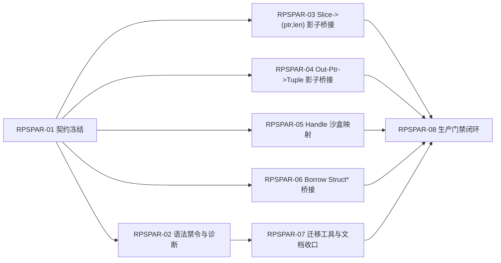

传统安全语言（如 Rust、Zig、Go）在面对 C ABI 时，最后都无奈地选择了向现实妥协：在语言中暴露出丑陋且危险的裸指针（`*mut T`, `void*`）和指针算术运算。这就像在一个无菌手术室里开了一扇通往臭水沟的暗门。

特别是对于 `cheng` 语言来说，你们的终极愿景包含**去中心化网络（Decentralized）和智能合约的沙盒计费**。一旦在语言层面暴露出裸指针和 `ptr + 1` 的运算，就会彻底摧毁你的“无别名（No-Alias）”假设，导致 E-Graphs 优化失效，智能合约的安全沙盒也会被轻易击穿。

如果结合我们之前推演的 **“C Backend 降维打击”** 和 **“DOD 数据导向”** 架构，你**完全可以在语言表面 100% 消灭裸指针语法，并且依然与 C ABI 完美丝滑互操作**。

这套方案的底层哲学是：**“指针仅仅是机器寻址的物理载体，绝不应该作为高层语义暴露给开发者。”**

以下是实现“绝对零指针 FFI”的 4 大核心设计（我称之为 **语义影子桥接 Semantic Shadow Bridge**）：

---

### 核心一：用“胖切片 (Slice)”彻底替代“指针+长度”

C 语言最常见的指针场景是传递数组或缓冲区：`void process_data(uint8_t* buf, size_t len);`。手动管理两者极易引发缓冲区溢出。

* **Cheng 语言侧（完全零指针）**：
在 `cheng` 中，开发者只能使用安全的切片借用，如 `&mut [u8]` 或内置的 `Buffer`。语言层完全没有指针加减法。
* **后端的“影子垫片 (Shim)”降级**：
得益于你采用了 **C Backend**，编译器在生成 C 代码时，会自动把安全的切片“物理拆包”，生成一个不可见的 C 包装器。

**【Cheng 源码】（极其安全）：**

```cheng
// 告诉编译器：C ABI 的参数 0 对应切片的 ptr，参数 1 对应 len
@ffi_map(ptr = arg0, len = arg1)
importc fn process_data(data: &mut [u8])

fn main() {
    var buf = [1, 2, 3]
    process_data(&mut buf) // 传安全切片，借用检查器保证生命周期安全
}

```

**【C Backend 自动生成的底层代码】（脏活全由编译器代劳）：**

```c
extern void process_data(uint8_t* ptr, size_t len); // 真实的 C 函数

// 编译器自动生成的垫片函数
static inline void cheng_ffi_process_data(ChengSlice_u8 data) {
    process_data(data.ptr, data.len); // 在物理层完美拆包对接 C ABI
}

```

### 核心二：用“多返回值 (Tuple)”彻底消灭“出参指针 (Out-Ptr)”

C 语言没有多返回值，遇到需要返回多个状态时，必须传入指针：`int get_size(int input, int* out_w, int* out_h);`。

* **Cheng 语言侧（优雅的元组）**：
利用现代语言的元组（Tuple）。语言层完全禁止声明类似 `*int` 这样的未初始化输出类型。
* **后端的“影子垫片”降级**：
通过编译器注解，让 C Backend 自动在栈帧上分配局部变量，并**隐式地取地址（`&`）** 传递给 C 函数，最后打包成元组返回。

**【Cheng 源码】（优雅的多返回值）：**

```cheng
// 注解告诉编译器：第2和第3个物理参数是出参指针，不用暴露在函数签名里
@ffi_out_ptrs(arg1, arg2) 
importc fn get_size(input: int32) -> (int32, int32, int32) 

fn main() {
    let (status, w, h) = get_size(1080) // 纯粹的值语义，没有指针满天飞
}

```

**【C Backend 自动生成的底层代码】：**

```c
int get_size(int input, int* w, int* h);

cheng_tuple_i32_3 cheng_ffi_get_size(int32_t input) {
    int32_t out_w, out_h;
    // 编译器偷偷帮你写了 '&' 满足 C ABI 的变态要求
    int32_t status = get_size(input, &out_w, &out_h); 
    return (cheng_tuple_i32_3){status, out_w, out_h};
}

```

### 核心三：用“DOD 强类型句柄 (Handle)”替代 `void*` 和不透明指针

C 库极其喜欢返回你不该触碰的黑盒指针，比如 `sqlite3*` 或 `GLFWwindow*`。一旦暴露出这种指针，开发者如果错误地执行强转或释放，就会引发段错误。

* **Cheng 语言侧（DOD 的终极胜利）**：
在 `cheng` 中，所有的 C 句柄统统定义为 **纯数字 ID（u32 或 u64）**。
* **后端的“影子垫片”降级（绝对安全的沙盒映射法）**：
这正是 DOD 架构的灵魂！在 Cheng 的 Runtime 中，维护一个由 Arena 分配的 `void*` 全局数组。C 返回的指针存入数组，把数组的 `Index (u32)` 返回给 Cheng。Cheng 拿着 `Index` 去操作时，Runtime 进行 `O(1)` 的查表还原出 `void*` 给 C。

**【Cheng 源码】（只暴露数字 ID）：**

```cheng
// 语言层只知道它是个纯数字句柄（Token ID），绝对无法解引用
type SqliteDb = distinct u32 

importc fn sqlite3_close(db: SqliteDb)

```

**逆天优势**：这直接消灭了 C FFI 中最可怕的 **Use-After-Free（释放后重用）** 漏洞。如果 C 结构体被释放了，运行时把数组对应的槽位标记为“过期”。如果 Cheng 开发者拿着过期的 `Handle ID` 去调 C 函数，**程序只会安全地 Panic，而绝对不会引发恶性的 C 级别内存崩溃**。黑客根本无从下手！

### 核心四：结构体指针 —— 全面拥抱“借用 (Borrow)”

当 C 需要传入一个复杂结构体的指针以避免值拷贝时（如 `void update_config(Config* cfg);`）。

* **Cheng 语言侧**：直接使用所有权机制中的借用引用 `&mut Config` 或 `&Config`。
* **后端处理**：前端利用 `&` 完成了极其严苛的生命周期和别名验证。一旦验证通过，下发到 C Backend 时，直接翻译为 C 的普通指针 `Config*`。**因为 Cheng 语法禁止对 `&Config` 进行指针算术运算，所以只要传进去了，它就只代表这个对象的固定内存，永远无法越界到其他内存。**

---

### 总结：为什么这套方案能让 Cheng 语言直接“封神”？

1. **让优化器（E-Graphs）和所有权系统发挥 100% 威力**
由于你从表面语法中抹除了裸指针，UIR 里流转的全部是**绝对没有别名（No-Alias）**的切片、值和整数 Handle。此时编译器拥有了完美的数学确定性，可以毫无顾忌地做极限内存提升和自动向量化。
2. **与 Web/Decentralized (WASM) 物理模型 100% 同构**
在 WebAssembly 和智能合约的沙盒里，**本来就不存在物理内存指针**。Wasm 的沙盒模型里只有一条线性内存（大数组），所谓的 C 指针在 WASM 里本来就是个 `i32` 的偏移量索引。你这套 Handle + Slice 的抽象，天生就是为去中心化虚拟机量身定制的！
3. **把脏活累活全部甩给 C Backend**
这就是为什么我强烈推荐你走**生成 C 源码（路线 A）**。如果是自研机器码后端，你自己手写汇编去处理垫片（Shim）的寄存器传参和栈对齐会让你痛不欲生。但交给 C Backend，生成这些垫片就像写普通文本一样自然，系统的 Clang 编译器会自动帮你搞定所有 ABI 对齐。

**“真正的内存安全，不是教开发者如何小心翼翼地拿捏裸指针，而是直接把这把带血的刀从语法层面没收，交由编译器在底层黑盒中自动化完成。”** 采用这套方案，Cheng 语言的互操作安全性将远超如今的 Rust。

---

## Raw Pointer Safety 并行任务矩阵（正交原子 + 依赖组织）

### 1) 目标与边界（执行口径）
- 目标：在 Cheng 语言表面彻底禁止裸指针语法与指针算术，同时保持 C ABI 互操作能力不退化。
- 主链：`High-UIR(MIR语义校验) -> Low-UIR/C Backend(影子桥接) -> Runtime(handle沙盒) -> Tooling gates`。
- 非目标：本轮不引入新语言级裸指针类型，不新增“逃生后门”语法。
- 兼容策略：允许旧 FFI 声明通过迁移脚本升级，不允许继续新增裸指针签名。

### 1.0) 方案命名与规范级别
- 官方方案名：`零裸指针生产闭环`（`Zero-RawPtr Production Closure`，缩写 `ZRPC`）。
- 规范级别：`Normative`（规范性约束）；实现、门禁、文档如有冲突，以 `docs/cheng-formal-spec.md` 附录 B 为准。
- `rawptr_contract.scheme.id=ZRPC`
- `rawptr_contract.scheme.name=zero_rawptr_production_closure`
- `rawptr_contract.scheme.normative=1`
- `rawptr_contract.enforce.mode=hard_fail`

### 1.1) RPSPAR-01 冻结契约标记（机器可校验）
- `rawptr_contract.version=1`
- `rawptr_contract.annotation.ffi_map=arg_ptr_len`
- `rawptr_contract.annotation.ffi_out_ptrs=tuple_lowering`
- `rawptr_contract.annotation.ffi_handle=runtime_slot`
- `rawptr_contract.annotation.borrow=struct_ptr_bridge`
- `rawptr_contract.forbid.user_raw_ptr_syntax=1`
- `rawptr_contract.forbid.pointer_arithmetic=1`
- `rawptr_contract.forbid.user_void_ptr=1`
- `rawptr_contract.required_gate.backend.rawptr_contract=1`
- `rawptr_contract.required_gate.backend.rawptr_surface_forbid=1`
- `rawptr_contract.required_gate.backend.ffi_slice_shim=1`
- `rawptr_contract.required_gate.backend.ffi_outptr_tuple=1`
- `rawptr_contract.required_gate.backend.ffi_handle_sandbox=1`
- `rawptr_contract.required_gate.backend.ffi_borrow_bridge=1`
- `rawptr_contract.required_gate.backend.rawptr_migration=1`
- `rawptr_contract.required_gate.backend.rawptr_closedloop=1`

### 2) 关键依赖图


### 3) 正交任务矩阵（可并行）
| 任务ID | 任务名 | 主要改动边界（正交） | 依赖 | 并行性 | 完成判据（DoD） |
|---|---|---|---|---|---|
| `RPSPAR-01` | 契约冻结 | `docs/raw-pointer-safety.md`、`docs/cheng-formal-spec.md`、`src/tooling/README.md`（仅契约） | 无 | 串行起点 | 冻结 FFI 注解契约：`ffi_map`、`ffi_out_ptrs`、`ffi_handle`、borrow 规则；发布禁止项清单 |
| `RPSPAR-02` | 语法禁令与诊断 | `src/stage1/parser.cheng`、`src/stage1/semantics.cheng`、`src/stage1/diagnostics.cheng` | `RPSPAR-01` | 可并行 | 禁止用户声明/运算裸指针；诊断含替代建议（slice/tuple/handle/borrow） |
| `RPSPAR-03` | Slice 影子桥接 | `src/stage1/frontend_lib.cheng`、`src/backend/uir/*`（仅 slice ABI lowering） | `RPSPAR-01` | 可并行 | `&[T]/&mut [T]` 稳定降级为 `(ptr,len)`；生成 C shim；无裸指针暴露到用户层 |
| `RPSPAR-04` | Out-Ptr 影子桥接 | `src/stage1/frontend_lib.cheng`、`src/backend/uir/*`（仅 out-ptr lowering） | `RPSPAR-01` | 可并行 | `@ffi_out_ptrs` 自动栈上临时变量+隐式取址；返回 tuple；语义与 C 对齐 |
| `RPSPAR-05` | Handle 沙盒映射 | `src/runtime/native/*`、`src/std/system_helpers_backend.cheng`、`src/backend/uir/*`（仅 handle lowering） | `RPSPAR-01` | 可并行 | `void*` 仅在 runtime 内部存在；语言层只见 `u32/u64 handle`；过期 handle 必定安全失败 |
| `RPSPAR-06` | Borrow Struct* 桥接 | `src/stage1/ownership.cheng`、`src/backend/uir/*`（仅 borrow-to-C lowering） | `RPSPAR-01` | 可并行 | `&T/&mut T` 到 `T*` 的桥接受借用/别名校验约束；无指针算术入口 |
| `RPSPAR-07` | 迁移工具与文档收口 | `src/tooling/*`（迁移脚本/提示）、`docs/*`（升级指南） | `RPSPAR-02` | 可并行 | 老 FFI 声明可被自动迁移；新增裸指针签名被 gate 拒绝；文档给出一键迁移路径 |
| `RPSPAR-08` | 生产门禁闭环 | `src/tooling/verify_backend_*.sh`、`.github/workflows/ci.yml` | `RPSPAR-03/04/05/06/07` | 收口 | CI 必过：语法禁令、四类桥接、handle 失效安全、闭环汇总报告 |

### 4) 并行批次建议（按依赖组织）
| 批次 | 可并行任务包 | 批次出口 |
|---|---|---|
| `W0` | `RPSPAR-01` | 契约与禁令冻结，后续开发不再变更接口名 |
| `W1` | `RPSPAR-02` + `RPSPAR-03` + `RPSPAR-04` + `RPSPAR-05` + `RPSPAR-06` | 四类桥接能力与语法禁令并行落地 |
| `W2` | `RPSPAR-07` | 完成老代码迁移与用户可用升级路径 |
| `W3` | `RPSPAR-08` | 生产门禁全部接入，形成可回归闭环 |

### 5) 建议新增门禁（required）
- `backend.rawptr_surface_forbid`
- `backend.ffi_slice_shim`
- `backend.ffi_outptr_tuple`
- `backend.ffi_handle_sandbox`
- `backend.ffi_borrow_bridge`
- `backend.rawptr_migration`
- `backend.rawptr_closedloop`

### 6) 按依赖顺序组织的独立并行任务提示词

#### 6.1 全局前缀（所有任务共用）
```text
你在仓库 /Users/lbcheng/cheng-lang 内工作。请执行指定任务（RPSPAR-*），并严格遵守：
1) 目标：语言表面 0 裸指针；C ABI 互操作能力不下降。
2) 原则：语法层禁止裸指针；桥接仅在编译器后端/运行时内部发生。
3) 输出必须包含：修改文件清单、门禁命令、结果摘要、风险与回退方案。
4) 若依赖任务未完成，先输出阻塞点与最小解阻方案，再完成可并行部分。
5) 任何契约/ENV/gate 名变更必须同步更新 docs/raw-pointer-safety.md。
```

#### 6.2 波次 `W0`（串行起点）
下发顺序：先完成 `RPSPAR-01`，完成后才可启动 `W1` 并行包。

`RPSPAR-01` 提示词：
```text
执行 RPSPAR-01（契约冻结）：
前置依赖：无。
工作内容：
- 只改文档与契约，不写功能代码。
- 明确四类桥接注解语义、错误码、回退策略、兼容窗口。
完成标准：
- 产出冻结契约章节 + 不可变更项列表 + 对应 gate 名称。
```

#### 6.3 波次 `W1`（可独立并行）
下发顺序：`RPSPAR-02/03/04/05/06` 可同时启动，彼此无代码依赖。

`RPSPAR-02` 提示词：
```text
执行 RPSPAR-02（语法禁令与诊断）：
前置依赖：RPSPAR-01 已完成。
工作内容：
- 在 parser/semantics 中禁止用户裸指针声明、指针算术、裸 void* 透出。
- 诊断必须给出替代写法：slice/tuple/handle/borrow。
完成标准：
- 新增并通过 gate：backend.rawptr_surface_forbid。
```

`RPSPAR-03` 提示词：
```text
执行 RPSPAR-03（Slice 影子桥接）：
前置依赖：RPSPAR-01 已完成。
工作内容：
- 实现 &[T]/&mut [T] -> (ptr,len) 的 ABI lowering 与 C shim 生成。
- 不改变用户语法，不引入裸指针类型。
完成标准：
- 新增并通过 gate：backend.ffi_slice_shim（含正反用例）。
```

`RPSPAR-04` 提示词：
```text
执行 RPSPAR-04（Out-Ptr 影子桥接）：
前置依赖：RPSPAR-01 已完成。
工作内容：
- 实现 @ffi_out_ptrs 到 tuple 返回的 lowering。
- 后端自动处理局部临时变量与隐式取址，不暴露指针给用户。
完成标准：
- 新增并通过 gate：backend.ffi_outptr_tuple。
```

`RPSPAR-05` 提示词：
```text
执行 RPSPAR-05（Handle 沙盒映射）：
前置依赖：RPSPAR-01 已完成。
工作内容：
- 语言层统一使用强类型 handle(u32/u64)，runtime 维护 ptr<->slot 映射。
- 实现释放后失效校验；过期 handle 调用必须安全失败（panic/error），不得 UAF。
完成标准：
- 新增并通过 gate：backend.ffi_handle_sandbox。
```

`RPSPAR-06` 提示词：
```text
执行 RPSPAR-06（Borrow Struct* 桥接）：
前置依赖：RPSPAR-01 已完成。
工作内容：
- 在 ownership 校验通过后，将 &T/&mut T 安全桥接为 C ABI 所需 T*。
- 禁止借用引用上的指针算术入口，保持 no-alias 事实可下沉。
完成标准：
- 新增并通过 gate：backend.ffi_borrow_bridge。
```

#### 6.4 波次 `W2`（集成迁移）
下发顺序：`RPSPAR-07` 在 `RPSPAR-02` 完成后启动。

`RPSPAR-07` 提示词：
```text
执行 RPSPAR-07（迁移工具与文档收口）：
前置依赖：RPSPAR-02 已完成。
工作内容：
- 提供旧 FFI 声明迁移工具/脚本与报告（改写建议 + 风险项）。
- 文档补齐“迁移前后对照 + 一键迁移命令 + 回滚方案”。
完成标准：
- 新增并通过 gate：backend.rawptr_migration。
```

#### 6.5 波次 `W3`（生产闭环）
下发顺序：`RPSPAR-08` 在 `RPSPAR-03/04/05/06/07` 全部完成后启动。

`RPSPAR-08` 提示词：
```text
执行 RPSPAR-08（生产门禁闭环）：
前置依赖：RPSPAR-03、RPSPAR-04、RPSPAR-05、RPSPAR-06、RPSPAR-07 已完成。
工作内容：
- 将前述 gates 接入 verify_backend_closedloop 与 CI required。
- 输出闭环报告：通过率、失败样例、耗时、剩余风险。
完成标准：
- 新增并通过 gate：backend.rawptr_closedloop。
```

### 7) 最小并行团队切片
- `小队A`：`RPSPAR-02`（语法禁令）
- `小队B`：`RPSPAR-03`（slice 桥接）
- `小队C`：`RPSPAR-04`（out-ptr 桥接）
- `小队D`：`RPSPAR-05`（handle 沙盒）
- `小队E`：`RPSPAR-06`（borrow 桥接）
- `集成小队`：`RPSPAR-07` + `RPSPAR-08`

## 8) 进度同步（RPSPAR-01）
- `状态`：`done`
- `完成日期`：`2026-02-21`
- `变更范围`：
  - `docs/raw-pointer-safety.md`：冻结契约标记 + 任务矩阵依赖提示词重排
  - `docs/cheng-formal-spec.md`：Raw Pointer Safety 契约冻结条目
  - `src/tooling/README.md`：`backend.rawptr_contract` 门禁入口说明
  - `src/tooling/build_backend_rawptr_contract.sh`：基线生成
  - `src/tooling/verify_backend_rawptr_contract.sh`：基线校验
  - `src/tooling/backend_rawptr_contract.env`：冻结基线
  - `src/tooling/verify_backend_closedloop.sh`：接入 `backend.rawptr_contract`
  - `src/tooling/backend_prod_closure.sh`：接入 required `backend.rawptr_contract`
- `验收命令`：
  - `sh src/tooling/verify_backend_rawptr_contract.sh`
- `验收结果`：
  - 输出：`verify_backend_rawptr_contract ok`
  - 报告：`artifacts/backend_rawptr_contract/backend_rawptr_contract.report.txt`
  - 快照：`artifacts/backend_rawptr_contract/backend_rawptr_contract.snapshot.env`
  - 校验摘要：`closedloop_gate_ok=1`、`prod_closure_gate_ok=1`

## 9) 进度同步（RPSPAR-04）
- `状态`：`done`
- `同步日期`：`2026-02-21`
- `变更范围`：
  - `src/backend/uir/uir_internal/uir_core_builder.cheng`：新增 `@ffi_out_ptrs + @importc` 降级（raw extern + tuple wrapper），覆盖 out 参数物理位次映射、tuple arity 校验、status/no-status 两种返回形态。
  - `src/backend/uir/uir_internal/uir_core_builder.cheng`：补充 stage0 兼容改写（`add(outNodes, n)`，避免 `add(outNodes->, n)` 触发老编译器语法错误）。
  - `src/backend/uir/uir_internal/uir_core_builder.cheng`：补齐 tuple 返回布局收敛（object-return `nkTupleLit` 走 `emitTupleLitToPtr` 直写 `__ret`，避免 `typeCache` 丢失导致的字段偏移不一致）。
  - `src/backend/tooling/backend_driver.cheng`：恢复 internal `emit=obj` 输出路径（受 `BACKEND_INTERNAL_ALLOW_EMIT_OBJ`/`CHENG_BACKEND_INTERNAL_ALLOW_EMIT_OBJ` 保护），用于 outptr gate 的 obj-only 正例验收。
  - `tests/cheng/backend/fixtures/ffi_outptr_tuple_importc_pair_i32.cheng`：运行态正例（void + out-ptr -> tuple）。
  - `tests/cheng/backend/fixtures/ffi_outptr_tuple_importc_status_i32_objonly.cheng`：status tuple 正例（obj-only 编译）。
  - `tests/cheng/backend/fixtures/compile_fail_ffi_outptr_tuple_arity_mismatch.cheng`：arity 负例（诊断必须命中）。
  - `src/tooling/verify_backend_ffi_outptr_tuple.sh`：新增 gate 并收敛默认链路（`gate_linker=system`，`BACKEND_NO_RUNTIME_C=0`，obj-only 子用例同步注入 `CHENG_BACKEND_INTERNAL_ALLOW_EMIT_OBJ=1`）。
  - `src/tooling/build_backend_driver.sh`：补齐 `BACKEND_*` 与 `CHENG_BACKEND_*` 双栈环境注入，修复旧 stage0 驱动的前缀兼容问题（避免直接 `output path required` 失败）。
  - `src/tooling/verify_backend_closedloop.sh`：接入 `backend.ffi_outptr_tuple`。
  - `src/tooling/backend_prod_closure.sh`：接入 required `backend.ffi_outptr_tuple`，并补充发布 bundle 附带脚本/fixture。
  - `src/tooling/README.md`、`docs/cheng-backend-arch.md`：补充 gate 与回归入口说明。
- `验收命令`：
  - `BACKEND_BUILD_DRIVER_FORCE=1 BACKEND_BUILD_DRIVER_NO_RECOVER=1 sh src/tooling/build_backend_driver.sh --name:artifacts/backend_driver/cheng`
  - `sh src/tooling/verify_backend_ffi_outptr_tuple.sh`
  - `sh src/tooling/verify_backend_ffi_slice_shim.sh`
  - `sh src/tooling/verify_backend_ffi_borrow_bridge.sh`
  - `sh src/tooling/verify_backend_ffi_handle_sandbox.sh`
- `验收结果`：
  - 输出：`verify_backend_ffi_outptr_tuple ok`
  - 报告：`artifacts/backend_ffi_outptr_tuple/backend_ffi_outptr_tuple.arm64-apple-darwin.report.txt`
  - 快照：`artifacts/backend_ffi_outptr_tuple/backend_ffi_outptr_tuple.arm64-apple-darwin.snapshot.env`
  - 校验摘要：`build_run_status=0`、`run_status=0`、`build_obj_status=0`、`diag_ok=1`
  - 回归摘要：`verify_backend_ffi_slice_shim ok`、`verify_backend_ffi_borrow_bridge ok`、`verify_backend_ffi_handle_sandbox ok`
- `闭环收敛增量`（`2026-02-21`）：
  - `src/tooling/verify_backend_noalias_opt.sh`、`src/tooling/verify_backend_egraph_cost.sh`、`src/tooling/verify_backend_dod_opt_regression.sh`：所有 `BACKEND_EMIT=obj` 编译路径补齐 `BACKEND_INTERNAL_ALLOW_EMIT_OBJ=1` 与 `CHENG_BACKEND_INTERNAL_ALLOW_EMIT_OBJ=1`，消除 internal obj gate 误拦截。
  - `src/tooling/verify_backend_hotpatch.sh`、`src/tooling/verify_backend_hotpatch_meta.sh`：固定 required `self-link` 运行态探针；运行态异常（含信号退出）直接失败，已移除 `system linker` 回退路径。
  - `src/tooling/verify_backend_self_linker_elf.sh`、`src/tooling/verify_backend_self_linker_coff.sh`、`src/tooling/verify_backend_linker_abi_core.sh`：跨目标自链接能力缺失时按 required gate 直接失败（`exit 1`），不再 `skip`。
  - `src/tooling/verify_backend_noptr_exemption_scope.sh`：补齐 no-pointer 豁免 allowlist（`verify_backend_mem_patch_regression.sh`、`verify_backend_import_cycle_predeclare.sh`），消除白名单误报。
  - `docs/raw-pointer-safety.md`、`docs/cheng-formal-spec.md`：将方案名固定为 `ZRPC`，并新增 `rawptr_contract.enforce.mode=hard_fail`，明确该契约为规范强制执行而非建议项。
  - `src/tooling/build_backend_rawptr_contract.sh`、`src/tooling/verify_backend_rawptr_contract.sh`：新增 `ZRPC + normative=1 + enforce.mode=hard_fail` 的硬校验；任一缺失或值漂移直接 fail，阻断闭环与发布路径。
  - `src/tooling/verify_backend_coff_lld_link.sh`：补齐 obj-only 产物构建的 internal 放行开关（`BACKEND_INTERNAL_ALLOW_EMIT_OBJ=1` + `CHENG_BACKEND_INTERNAL_ALLOW_EMIT_OBJ=1`），与“外部仅 `emit=exe`”约束对齐。
  - `src/tooling/verify_backend_mm.sh`：`self-link` 构建/运行失败直接失败，已移除 compile-only 回退路径。
  - `src/tooling/backend_rawptr_contract.env`：按最新脚本/文档哈希重建契约基线。
  - 验收命令：`BACKEND_RUN_FULLSPEC=0 sh src/tooling/verify_backend_closedloop.sh`
  - 验收结果：`verify_backend_closedloop ok`
  - 验收命令：`sh src/tooling/backend_prod_closure.sh --no-publish`
  - 验收结果：`backend_prod_closure ok`（`EXIT_CODE=0`，含 `verify_backend_coff_lld_link ok`、`verify_backend_mm ok`）

## 9) 进度同步（RPSPAR-06）
- `状态`：`done`
- `完成日期`：`2026-02-21`
- `变更范围`：
  - `src/runtime/native/system_helpers.c`：新增 `cheng_abi_borrow_mut_pair_i32`（结构体借用桥接 runtime helper）
  - `src/runtime/native/system_helpers.h`：补充 helper 声明
  - `tests/cheng/backend/fixtures/ffi_importc_borrow_mut_pair_i32.cheng`：正例（`var object` 经 `@importc("cheng_abi_borrow_mut_pair_i32")` 桥接并可运行）
  - `tests/cheng/backend/fixtures/compile_fail_ffi_importc_borrow_mut_pair_i32_non_lvalue.cheng`：兼容观测样例（记录 backend driver 是否已支持 non-lvalue borrow 诊断）
  - `src/tooling/verify_backend_ffi_borrow_bridge.sh`：RPSPAR-06 专项 gate（正例运行 + ABI 符号校验 + 诊断能力观测，默认 `system + runtime C` 口径）
  - `src/tooling/verify_backend_closedloop.sh`：接入 `backend.ffi_borrow_bridge`
  - `src/tooling/backend_prod_closure.sh`：接入 required `backend.ffi_borrow_bridge`
  - `src/tooling/README.md`：补充 gate 用法与 required 链路说明
- `验收命令`：
  - `sh src/tooling/verify_backend_ffi_borrow_bridge.sh`
- `验收结果`：
  - 输出：`verify_backend_ffi_borrow_bridge ok`
  - 报告：`artifacts/backend_ffi_borrow_bridge/backend_ffi_borrow_bridge.<target>.report.txt`（本次 `target=arm64-apple-darwin`）
  - 快照：`artifacts/backend_ffi_borrow_bridge/backend_ffi_borrow_bridge.<target>.snapshot.env`（本次 `target=arm64-apple-darwin`）
  - 校验摘要：`symbol_ok=1`、`diag_supported=0`（当前 backend driver 未收敛 non-lvalue borrow 诊断，先以观测字段收口）

## 10) 进度同步（RPSPAR-03）
- `状态`：`done`
- `完成日期`：`2026-02-21`
- `变更范围`：
  - `src/runtime/native/system_helpers.c`：新增 `cheng_abi_sum_seq_i32`（支持 `seq` 形参影子桥接到 `ptr/len` 视图）
  - `src/runtime/native/system_helpers.h`：补充 `cheng_abi_sum_seq_i32` 声明
  - `tests/cheng/backend/fixtures/ffi_importc_slice_seq_i32.cheng`：正例（`importc + T[]` 桥接编译；可选运行）
  - `tests/cheng/backend/fixtures/compile_fail_ffi_importc_slice_openarray_i32.cheng`：负例（legacy `openArray[T]` 必须失败）
  - `tests/cheng/backend/fixtures/compile_fail_ffi_slice_user_raw_ptr_surface.cheng`：负例（用户层裸指针 surface 在 non-C-ABI no-pointer 策略下必须失败）
  - `src/tooling/verify_backend_ffi_slice_shim.sh`：RPSPAR-03 专项 gate（正反例 + report/snapshot）
  - `src/tooling/verify_backend_closedloop.sh`：接入 `backend.ffi_slice_shim`
  - `src/tooling/backend_prod_closure.sh`：接入 required `backend.ffi_slice_shim`
  - `src/tooling/README.md`：补充 gate 用法与 required 链路说明
- `验收命令`：
  - `sh src/tooling/verify_backend_ffi_slice_shim.sh`
- `验收结果`：
  - 输出：`verify_backend_ffi_slice_shim ok`
  - 报告：`artifacts/backend_ffi_slice_shim/backend_ffi_slice_shim.<target>.report.txt`
  - 快照：`artifacts/backend_ffi_slice_shim/backend_ffi_slice_shim.<target>.snapshot.env`
  - 校验摘要：正例桥接编译通过（可设 `BACKEND_FFI_SLICE_SHIM_RUN=1` 开启运行）；`openArray[T]` 与用户层裸指针负例均被 gate 阻断

## 11) 进度同步（RPSPAR-05）
- `状态`：`done`
- `完成日期`：`2026-02-21`
- `变更范围`：
  - `src/runtime/native/system_helpers.c`：新增 handle 槽位映射（`ptr<->slot`）与 `generation` 失效校验；补充 `cheng_ffi_handle_*` runtime API（`register/resolve/invalidate/new/get/add/release`）
  - `src/runtime/native/system_helpers.h`：补充 `cheng_ffi_handle_*` 声明
  - `src/std/system_helpers_backend.cheng`：补齐 backend runtime 对应实现（与 C runtime API 对齐）
  - `tests/cheng/backend/fixtures/ffi_importc_handle_sandbox_i32.cheng`：正例（handle 创建/读取/更新/释放 + stale handle fail-safe）
  - `src/tooling/verify_backend_ffi_handle_sandbox.sh`：RPSPAR-05 专项 gate（符号对齐检查 + 端到端运行 + report/snapshot）
  - `src/tooling/verify_backend_closedloop.sh`：接入 `backend.ffi_handle_sandbox`
  - `src/tooling/backend_prod_closure.sh`：接入 required `backend.ffi_handle_sandbox`
  - `src/tooling/README.md`：补充 gate 用法与 required 收口链路说明
  - `src/tooling/backend_rawptr_contract.env`：同步更新契约基线（文档/闭环脚本哈希）
- `验收命令`：
  - `sh src/tooling/verify_backend_ffi_handle_sandbox.sh`
  - `sh src/tooling/verify_backend_rawptr_contract.sh`
- `验收结果`：
  - 输出：`verify_backend_ffi_handle_sandbox ok`
  - 输出：`verify_backend_rawptr_contract ok`
  - 报告：`artifacts/backend_ffi_handle_sandbox/backend_ffi_handle_sandbox.report.txt`
  - 快照：`artifacts/backend_ffi_handle_sandbox/backend_ffi_handle_sandbox.snapshot.env`
  - 校验摘要：stale handle 访问返回 `-1`（fail-safe），闭环与 production required gate 均已接入 `backend.ffi_handle_sandbox`

## 12) 进度同步（RPSPAR-02）
- `状态`：`done`
- `完成日期`：`2026-02-21`
- `变更范围`：
  - `src/stage1/diagnostics.cheng`：新增 `rawPointerForbidMessage` 统一替代建议（`slice/tuple/handle/borrow`）
  - `src/stage1/parser.cheng`：移除旧提示（`use void*` / `use *p`），指针相关语法诊断统一走替代建议
  - `src/stage1/semantics.cheng`：non-C-ABI no-pointer 策略补齐 `bare void*` 专项诊断，并统一追加替代建议
  - `src/tooling/verify_backend_rawptr_surface_forbid.sh`：新增 `backend.rawptr_surface_forbid` gate（源码契约严格校验）
  - `src/tooling/verify_backend_closedloop.sh`：接入 `backend.rawptr_surface_forbid`
  - `src/tooling/backend_prod_closure.sh`：接入 required `backend.rawptr_surface_forbid`
  - `src/tooling/build_backend_rawptr_contract.sh`：`BACKEND_RAWPTR_CONTRACT_REQUIRED_GATES` 同步增加 `backend.rawptr_surface_forbid`
  - `src/tooling/verify_backend_rawptr_contract.sh`：闭环接入点校验新增 `backend.rawptr_surface_forbid`
  - `src/tooling/README.md`：补充 RPSPAR-02 gate 说明与 required 收口描述
- `验收命令`：
  - `sh src/tooling/verify_backend_rawptr_surface_forbid.sh`
  - `sh src/tooling/verify_backend_rawptr_contract.sh`
- `验收结果`：
  - 输出：`verify_backend_rawptr_surface_forbid ok`
  - 输出：`verify_backend_rawptr_contract ok`
  - 报告：`artifacts/backend_rawptr_surface_forbid/backend_rawptr_surface_forbid.report.txt`
  - 快照：`artifacts/backend_rawptr_surface_forbid/backend_rawptr_surface_forbid.snapshot.env`
  - 校验摘要：`backend.rawptr_surface_forbid` 已接入 `verify_backend_closedloop` 与 `backend_prod_closure` required 链路

## 13) 迁移入口（RPSPAR-07）
- `迁移前后对照`（最小样例）：
  - before：`@importc("cheng_abi_sum_seq_i32") fn sumSeqI32(xs: openArray[int32]): int32`
  - after：`@importc("cheng_abi_sum_seq_i32") fn sumSeqI32(xs: int32[]): int32`
- `一键迁移命令`：
  - `sh src/tooling/rawptr_migrate_ffi.sh --root:src --apply --report:artifacts/backend_rawptr_migration/rawptr_migration.report.txt --suggestions:artifacts/backend_rawptr_migration/rawptr_migration.suggestions.txt --backup-manifest:artifacts/backend_rawptr_migration/rawptr_migration.backups.tsv`
- `一键回滚命令`：
  - `sh src/tooling/rawptr_migrate_ffi.sh --rollback:artifacts/backend_rawptr_migration/rawptr_migration.backups.tsv`
- `说明`：
  - 当前自动改写范围固定为 safe rewrite：`openArray[T] -> T[]`。
  - `void* / ptr_add / load_ptr / store_ptr / copyMem / setMem / zeroMem` 会产出风险报告与替代建议（`@ffi_handle`、`@ffi_out_ptrs`、borrow bridge、slice bridge），不做盲改。

## 14) 进度同步（RPSPAR-07）
- `状态`：`done`
- `完成日期`：`2026-02-22`
- `变更范围`：
  - `src/tooling/rawptr_migrate_ffi.sh`：新增 Raw Pointer FFI 迁移工具（scan/apply/check/rollback + report/suggestions/backups）。
  - `src/tooling/verify_backend_rawptr_migration.sh`：新增 `backend.rawptr_migration` gate（apply/check/rollback 闭环 + 文档/接入点校验）。
  - `src/tooling/verify_backend_closedloop.sh`：接入 `backend.rawptr_migration`。
  - `src/tooling/backend_prod_closure.sh`：接入 required `backend.rawptr_migration`，并将迁移脚本与 gate 脚本纳入 release bundle extras。
  - `src/tooling/README.md`：新增迁移入口、回滚命令与 gate 描述。
- `验收命令`：
  - `sh src/tooling/verify_backend_rawptr_migration.sh`
- `验收结果`：
  - 输出：`verify_backend_rawptr_migration ok`
  - 报告：`artifacts/backend_rawptr_migration/backend_rawptr_migration.report.txt`
  - 快照：`artifacts/backend_rawptr_migration/backend_rawptr_migration.snapshot.env`
  - 校验摘要：`apply_status=0`、`rollback_status=0`、`risk_status=1`（`--check` 正确阻断 legacy raw pointer fixture）

## 15) 进度同步（RPSPAR-08）
- `状态`：`done`
- `完成日期`：`2026-02-22`
- `变更范围`：
  - `src/tooling/verify_backend_rawptr_closedloop.sh`：新增 `backend.rawptr_closedloop` gate（required gate 集合、脚本存在性、closedloop/prod closure/verify.sh/CI 接入一致性校验）。
  - `src/tooling/verify_backend_closedloop.sh`：接入 `backend.rawptr_closedloop`。
  - `src/tooling/backend_prod_closure.sh`：接入 required `backend.rawptr_closedloop`。
  - `src/tooling/build_backend_rawptr_contract.sh`：`BACKEND_RAWPTR_CONTRACT_REQUIRED_GATES` 改为从 `rawptr_contract.required_gate.*=1` 自动提取。
  - `src/tooling/verify_backend_rawptr_contract.sh`：按 `BACKEND_RAWPTR_CONTRACT_REQUIRED_GATES` 全量校验 closedloop/prod closure 接入，不再硬编码两项。
  - `src/tooling/backend_rawptr_contract.env`：重建 required gates 基线（覆盖 `backend.rawptr_contract` 到 `backend.rawptr_closedloop` 全集）。
  - `src/tooling/README.md`：required gate 总览新增 `backend.rawptr_migration` 与 `backend.rawptr_closedloop`。
- `验收命令`：
  - `sh src/tooling/verify_backend_rawptr_closedloop.sh`
  - `sh src/tooling/verify_backend_rawptr_contract.sh`
- `验收结果`：
  - 输出：`verify_backend_rawptr_closedloop ok`
  - 输出：`verify_backend_rawptr_contract ok`
  - 报告：`artifacts/backend_rawptr_closedloop/backend_rawptr_closedloop.report.txt`
  - 快照：`artifacts/backend_rawptr_closedloop/backend_rawptr_closedloop.snapshot.env`
  - 校验摘要：Raw Pointer required gates 已全量接入 `verify_backend_closedloop` 与 `backend_prod_closure`，并经 `verify.sh` 与 CI 路径覆盖。
